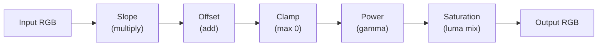

# CDL Color Correction

> **Attribution:** Portions of this guide are adapted from
> [OpenRV](https://github.com/AcademySoftwareFoundation/OpenRV) documentation,
> Copyright Contributors to the OpenRV Project, Apache License 2.0.
> Content has been rewritten for OpenRV Web's browser-based WebGL2 architecture.
> See [ATTRIBUTION.md](../ATTRIBUTION.md) for full details.

---

## Overview

The American Society of Cinematographers Color Decision List (ASC CDL) is an industry standard for communicating color correction values between different applications and stages of a post-production pipeline. CDL provides a compact, unambiguous mathematical model for primary color correction that is supported by virtually every professional color grading tool.

OpenRV Web implements the full ASC CDL specification with both GPU and CPU processing paths, support for all three standard file formats (`.cdl`, `.cc`, `.ccc`), and an optional ACEScct color space mode for improved perceptual uniformity.

---

## The ASC CDL Model

### SOP + Saturation Formula

CDL defines a two-stage transform applied to each pixel:

**Stage 1 -- SOP (Slope, Offset, Power):**

For each channel (R, G, B) independently:

```
out = pow(max(in * slope + offset, 0), power)
```

The operations are applied in strict SOP order:

1. **Slope** (multiplicative gain): Scales the input value. Default = 1.0.
2. **Offset** (additive shift): Adds a constant value. Default = 0.0.
3. **Clamp**: The result is clamped to a minimum of 0.0 before the power function to avoid NaN from negative inputs to non-integer exponents.
4. **Power** (gamma): Applies a power function. Default = 1.0.

**Stage 2 -- Saturation:**

After SOP, saturation is applied globally (not per-channel):

```
luma = 0.2126 * R + 0.7152 * G + 0.0722 * B
out  = luma + (in - luma) * saturation
```

Default saturation = 1.0 (no change). Values less than 1.0 desaturate; values greater than 1.0 increase saturation.



### Luminance Weights

OpenRV Web uses **Rec. 709 luminance weights** (Rw=0.2126, Gw=0.7152, Bw=0.0722) for the saturation calculation, implemented via the `luminanceRec709()` function. These are the standard weights defined in ITU-R BT.709 and used throughout the VFX industry.

The original OpenRV documentation references the same Rec.709 weights for its CDL saturation implementation.

### HDR Headroom

The CPU implementation (`applyCDLToValue()`) applies only a lower bound clamp (`max(v, 0)`) after the power function, deliberately omitting an upper clamp. This preserves super-white values (above 1.0) in HDR content. The GPU implementation similarly uses `max(vec3(0.0), ...)` without an upper bound.

---

## GPU Implementation

The CDL transform executes in the fragment shader at stage 6b, after color wheels and before curves:

```glsl
if (u_cdlEnabled) {
    // Optional: convert to ACEScct space
    if (u_cdlColorspace == 1) {
        color.rgb = linearToACEScct(color.rgb);
    }

    // CDL SOP + Saturation
    color.rgb = pow(max(color.rgb * u_cdlSlope + u_cdlOffset, vec3(0.0)), u_cdlPower);
    float cdlLuma = dot(color.rgb, LUMA);
    color.rgb = mix(vec3(cdlLuma), color.rgb, u_cdlSaturation);

    // Optional: convert back from ACEScct
    if (u_cdlColorspace == 1) {
        color.rgb = ACEScctToLinear(color.rgb);
    }
}
```

### CDL Uniforms

| Uniform | Type | Range | Default |
|---------|------|-------|---------|
| `u_cdlEnabled` | `bool` | -- | `false` |
| `u_cdlSlope` | `vec3` | 0.0 - 10.0 | `(1.0, 1.0, 1.0)` |
| `u_cdlOffset` | `vec3` | -1.0 - 1.0 | `(0.0, 0.0, 0.0)` |
| `u_cdlPower` | `vec3` | 0.1 - 3.0 | `(1.0, 1.0, 1.0)` |
| `u_cdlSaturation` | `float` | 0.0 - 2.0 | `1.0` |
| `u_cdlColorspace` | `int` | 0 or 1 | `0` |

### CPU Fallback

The CPU path (`applyCDLToImageData()` in `src/color/CDL.ts`) processes ImageData in-place, operating on 0-255 values that are normalized to 0-1 for the CDL formula and then converted back. The CPU path is used when WebGL2 is not available or for non-interactive batch processing.

---

## ACEScct Mode

When `u_cdlColorspace == 1`, the shader wraps CDL operations in linear-to-ACEScct and ACEScct-to-linear conversions. This enables CDL to operate in ACEScct space, which provides better perceptual uniformity for color grading.

### Why ACEScct?

CDL was originally designed for film-density (log) encoded images. Applying CDL directly to scene-referred linear data can produce unexpected results because the slope, offset, and power parameters have non-intuitive visual effects in linear space. ACEScct provides a log-like encoding that:

- Makes CDL controls behave more intuitively (closer to the behavior colorists expect from working in log space).
- Preserves the mathematical properties of the CDL formula.
- Is compatible with ACES workflows.

### ACEScct Conversion Functions

**Linear to ACEScct** (per channel):

```
if x <= 0.0078125:  ACEScct = x * 10.5402377416545 + 0.0729055341958355
else:               ACEScct = (log2(x) + 9.72) / 17.52
```

**ACEScct to Linear** (per channel):

```
if x <= 0.155251:   linear = (x - 0.0729055341958355) / 10.5402377416545
else:               linear = 2^(x * 17.52 - 9.72)
```

These conversions are defined in ACES Technical Bulletin TB-2014-004.2. The implementation applies the encoding directly in the working colorspace (Rec.709) rather than converting to AP1 primaries first, matching the behavior of the original OpenRV.

---

## File Format Support

OpenRV Web supports all three standard CDL file formats. The parser implementation is in `src/color/CDL.ts`.

### .cdl (Color Decision List)

The primary CDL interchange format. Contains a `<ColorDecisionList>` root element with one or more `<ColorDecision>` elements, each containing a `<ColorCorrection>`:

```xml
<?xml version="1.0" encoding="UTF-8"?>
<ColorDecisionList xmlns="urn:ASC:CDL:v1.2">
  <ColorDecision>
    <ColorCorrection id="shot_001">
      <SOPNode>
        <Slope>1.100000 1.000000 0.900000</Slope>
        <Offset>-0.020000 0.000000 0.020000</Offset>
        <Power>1.000000 1.000000 1.000000</Power>
      </SOPNode>
      <SatNode>
        <Saturation>1.100000</Saturation>
      </SatNode>
    </ColorCorrection>
  </ColorDecision>
</ColorDecisionList>
```

**Parser**: `parseCDLXML(xml)` -- returns a `CDLValues` object or `null` on parse failure.

### .cc (Color Correction)

A single `<ColorCorrection>` root element. This is the simplest CDL format, containing exactly one correction:

```xml
<ColorCorrection id="dailies_grade">
  <SOPNode>
    <Slope>1.050000 1.000000 0.980000</Slope>
    <Offset>0.010000 0.000000 -0.005000</Offset>
    <Power>1.020000 1.000000 1.010000</Power>
  </SOPNode>
  <SatNode>
    <Saturation>1.050000</Saturation>
  </SatNode>
</ColorCorrection>
```

**Parser**: `parseCC(xml)` -- returns a `CDLEntry` object. Throws descriptive errors on invalid input. Handles XML namespace prefixes by stripping them for element name comparison.

### .ccc (Color Correction Collection)

A `<ColorCorrectionCollection>` root element containing multiple `<ColorCorrection>` entries, each with an optional `id` attribute:

```xml
<ColorCorrectionCollection>
  <ColorCorrection id="shot_001">
    <SOPNode>
      <Slope>1.100000 1.000000 0.900000</Slope>
      <Offset>0.000000 0.000000 0.000000</Offset>
      <Power>1.000000 1.000000 1.000000</Power>
    </SOPNode>
    <SatNode><Saturation>1.000000</Saturation></SatNode>
  </ColorCorrection>
  <ColorCorrection id="shot_002">
    <SOPNode>
      <Slope>0.950000 1.050000 1.000000</Slope>
      <Offset>0.010000 -0.010000 0.000000</Offset>
      <Power>1.000000 1.000000 1.020000</Power>
    </SOPNode>
    <SatNode><Saturation>0.950000</Saturation></SatNode>
  </ColorCorrection>
</ColorCorrectionCollection>
```

**Parser**: `parseCCC(xml)` -- returns an array of `CDLEntry` objects, each with an optional `id` property. Unlike the original OpenRV, which reads only the first correction from `.ccc` files, OpenRV Web returns **all entries** with their IDs, allowing the user to select the appropriate correction for each shot.

### Validation

All parsers perform thorough validation:

- XML parse errors are detected via the `<parsererror>` element.
- Root element names are checked against expected values (with namespace prefix stripping).
- Numeric values are validated -- non-numeric slope, offset, or power values produce descriptive error messages indicating which parameter failed.
- Missing elements default to identity values (slope=1, offset=0, power=1, saturation=1).

### Export

`exportCDLXML(cdl, id?)` generates a standard CDL v1.2 XML document:

```typescript
const xml = exportCDLXML(cdlValues, 'grade_001');
// Produces a valid <ColorDecisionList> XML string
```

Values are exported with 6 decimal places of precision.

---

## Pipeline Integration

### Position in the Rendering Pipeline

CDL is applied at **stage 6b** in the fragment shader pipeline, after color wheels (lift/gamma/gain) and before curves:

```
... -> Color Wheels (6a) -> CDL (6b) -> Curves (6c) -> Look LUT (6d) -> ...
```

This placement ensures that CDL operates on values that have already been through exposure, contrast, saturation, and basic tonal adjustments, but before creative LUTs and tone mapping.

### Effect of SOP Parameters

Understanding how each SOP parameter affects the image helps colorists achieve predictable results:

- **Slope** controls gain (brightness of the entire image proportionally). A slope of 1.2 brightens the image by 20%; a slope of 0.8 darkens by 20%. In linear light, slope is equivalent to adjusting the aperture or light intensity.
- **Offset** adds or subtracts a constant value. Positive offset lifts the blacks (adds a "fog" effect); negative offset crushes the blacks. Offset is most visible in shadow regions where the signal is low.
- **Power** applies a gamma curve. Power greater than 1.0 darkens the midtones (compresses); power less than 1.0 brightens the midtones (expands). Power does not affect pure black (0) or pure white (1 in a normalized pipeline).

When working in linear light (the default mode), these parameters behave differently from log-encoded workflows. Slope changes are more dramatic in highlights, and offset can easily push highlights into super-white territory. For more intuitive behavior, enable ACEScct mode, which provides a log-like encoding where SOP parameters map more closely to traditional film grading controls.

### Comparison with OpenRV

The original OpenRV provides CDL at two insertion points:

1. **RVLinearize** (pre-linearization): CDL applied in file-encoded space, before linearization.
2. **RVColor** (post-linearization): CDL applied in linear light, after linearization.

OpenRV Web applies CDL **post-linearization only** (in linear light or optionally in ACEScct space). The pre-linearization CDL point is not implemented because modern workflows typically apply CDL in a log or linear working space rather than in file-encoded space.

### CDL Node

In the node graph system, `CDLNode` (`src/nodes/effects/CDLNode.ts`) provides per-source CDL assignment. Each source can have independent CDL values that persist in the session state (`SessionState.cdl`).

---

## Workflow Examples

### Interactive CDL Adjustment

1. Open the **CDL Panel** from the color controls.
2. Adjust **Slope**, **Offset**, and **Power** sliders for each channel (R, G, B).
3. Adjust the **Saturation** slider.
4. Double-click any slider to reset it to its default value.
5. Changes are applied in real time through the GPU pipeline.

### Loading CDL from File

1. In the CDL panel, use the file picker to load a `.cdl`, `.cc`, or `.ccc` file.
2. For `.ccc` files with multiple entries, select the desired correction from the list.
3. The loaded values populate the SOP and saturation controls.

### Saving CDL for Interchange

1. After grading, use the **Export** function to save the current CDL values.
2. The exported `.cdl` file uses the standard CDL v1.2 XML schema.
3. The file can be imported into DaVinci Resolve, Nuke, Baselight, or any CDL-compatible application.

### Round-Trip Workflow

A typical round-trip between OpenRV Web and a grading application:

1. **On set / dailies**: View footage in OpenRV Web, apply initial CDL corrections for exposure and color balance.
2. **Export**: Save CDL values as a `.cdl` file.
3. **Grading suite**: Import the CDL into DaVinci Resolve or Nuke as a starting point for final grading.
4. **Review**: Export updated CDL from the grading suite, reload in OpenRV Web for review.

### Using ACEScct Mode

For ACES workflows:

1. Enable **ACEScct** mode in the CDL panel settings.
2. CDL controls now operate in ACEScct space, providing more intuitive behavior for slope and offset adjustments.
3. The conversion to/from ACEScct is handled automatically in the shader.
4. Exported CDL files contain the same numeric values regardless of the working colorspace -- the ACEScct wrapping is a display/grading convenience, not part of the CDL data.

---

## TypeScript API

The CDL module (`src/color/CDL.ts`) exports the following:

```typescript
// Types
interface CDLValues {
  slope: { r: number; g: number; b: number };
  offset: { r: number; g: number; b: number };
  power: { r: number; g: number; b: number };
  saturation: number;
}

interface CDLEntry extends CDLValues {
  id?: string;
}

// Constants
const DEFAULT_CDL: CDLValues;

// Functions
function isDefaultCDL(cdl: CDLValues): boolean;
function applyCDL(r: number, g: number, b: number, cdl: CDLValues): { r; g; b };
function applyCDLToImageData(imageData: ImageData, cdl: CDLValues): void;
function parseCDLXML(xml: string): CDLValues | null;
function parseCC(xml: string): CDLEntry;
function parseCCC(xml: string): CDLEntry[];
function exportCDLXML(cdl: CDLValues, id?: string): string;
```

---

## Related Pages

- [Rendering Pipeline](rendering-pipeline.md) -- CDL's position in the full pipeline (stage 6b)
- [LUT System](lut-system.md) -- LUTs work alongside CDL for complete color pipelines
- [OCIO Color Management](ocio-color-management.md) -- OCIO can provide the working space context for CDL
