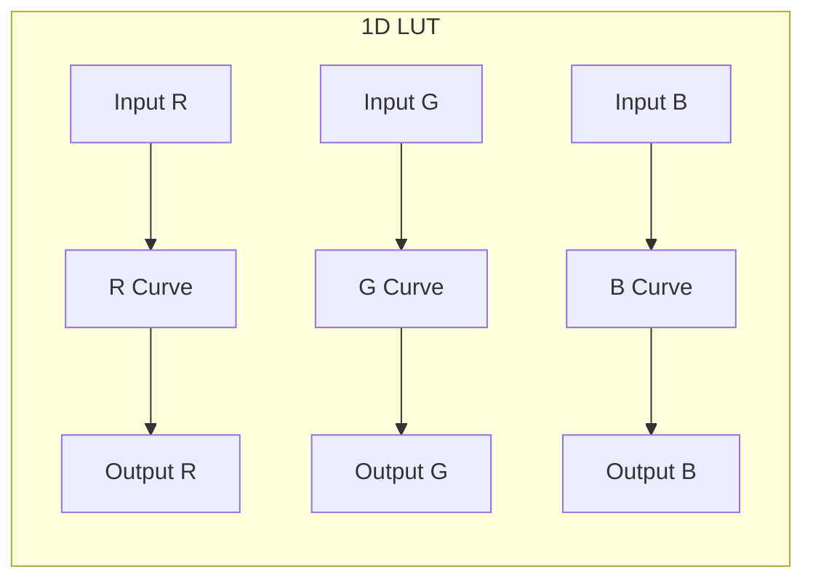
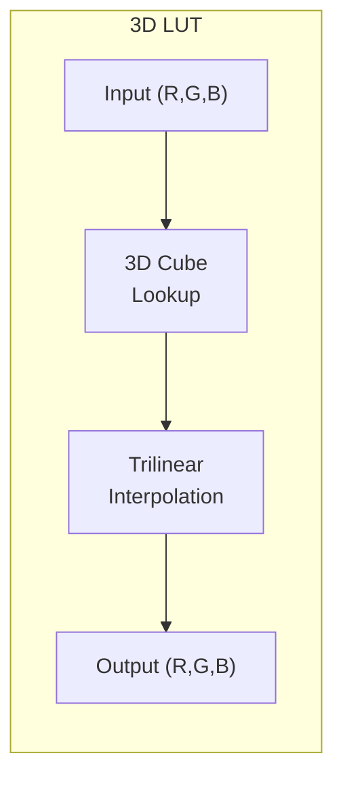
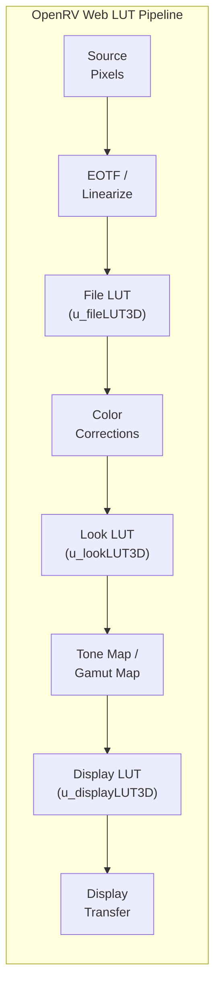
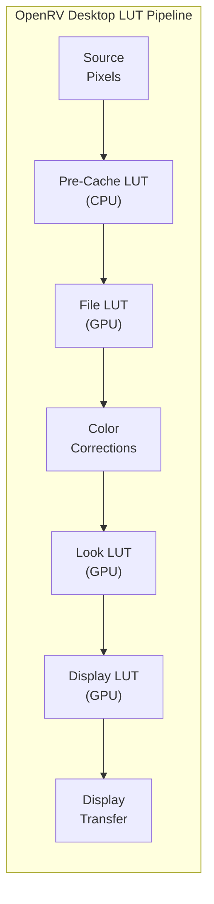

# LUT System

> **Attribution:** Portions of this guide are adapted from
> [OpenRV](https://github.com/AcademySoftwareFoundation/OpenRV) documentation,
> Copyright Contributors to the OpenRV Project, Apache License 2.0.
> Content has been rewritten for OpenRV Web's browser-based WebGL2 architecture.
> See [ATTRIBUTION.md](../ATTRIBUTION.md) for full details.

---

## Overview

A Look-Up Table (LUT) is a precomputed mapping from input color values to output color values. LUTs encode complex color transforms -- ranging from simple gamma curves to elaborate film stock emulations -- in a format that can be applied to every pixel in constant time. OpenRV Web uses LUTs throughout the rendering pipeline for input device transforms, creative grading, display calibration, and film emulation.

---

## 1D vs 3D LUT Concepts

### 1D LUTs

A 1D LUT applies an independent transfer function to each color channel. It is essentially three separate curves (one for red, one for green, one for blue). Each entry maps a single input value to a single output value per channel.

**Capabilities:**
- Gamma correction
- Contrast curves (S-curves, log-to-linear)
- Per-channel color balance
- Transfer function conversion (sRGB, Rec.709, PQ)

**Limitations:**
- Cannot model channel crosstalk (where the red output depends on the green or blue input).
- Cannot perform hue rotations, saturation changes, or cross-channel color grading.

In OpenRV Web, 1D LUTs are stored as 2D textures (`size x 3`, one row per channel) with `R32F` precision and hardware linear interpolation.

### 3D LUTs

A 3D LUT maps an (R, G, B) input triplet to a new (R, G, B) output triplet. The LUT data is arranged as a cube where each axis represents one input channel. The cube is sampled at the input color's coordinates, and the output is interpolated from the surrounding lattice points.

**Capabilities:**
- All 1D LUT operations, plus:
- Channel crosstalk (hue shifts, color matrix transforms)
- Saturation and vibrance adjustments
- Complex film stock emulations
- Complete color space conversions

**Memory:**
A 3D LUT of size N requires N x N x N x 3 floating-point values. Common sizes:

| Size | Entries | Memory (Float32) |
|------|---------|-----------------|
| 17 | 4,913 | ~57 KB |
| 33 | 35,937 | ~420 KB |
| 65 | 274,625 | ~3.1 MB |

Larger LUTs capture finer color distinctions but consume more GPU memory and texture cache.

### WebGL2 3D Textures

OpenRV Web stores 3D LUTs as WebGL2 `TEXTURE_3D` objects. This provides several advantages:

- **Hardware trilinear interpolation**: The GPU's texture unit performs trilinear interpolation across the 8 surrounding lattice points automatically when sampling with `texture()`. This is significantly faster than computing interpolation in the shader.
- **Float32 precision**: LUT textures use `RGB32F` internal format, avoiding the 8-bit quantization bottleneck found in some LUT implementations.
- **Single-pass evaluation**: LUT application requires only a single `texture()` call per pixel, regardless of LUT size.





### CPU Fallback: Tetrahedral Interpolation

For offline or high-quality processing, OpenRV Web includes a CPU-based tetrahedral interpolation path (`TetrahedralInterp.ts`). Tetrahedral interpolation divides each lattice cube into six tetrahedra and interpolates within the containing tetrahedron, producing slightly more accurate results than trilinear interpolation at the cost of higher computational complexity. The GPU path uses trilinear interpolation exclusively.

### LUT Texture Upload

The `createLUTTexture()` function in `LUTLoader.ts` handles the WebGL2 texture creation:

1. A `TEXTURE_3D` object is created and bound.
2. Wrapping is set to `CLAMP_TO_EDGE` on all three axes (S, T, R) to prevent color bleeding at domain boundaries.
3. Filtering is set to `LINEAR` for both minification and magnification, enabling hardware trilinear interpolation.
4. Data is uploaded as `RGB32F` (32-bit float per channel) using `texImage3D()`.

For 1D LUTs, a `TEXTURE_2D` is created with dimensions `size x 3` (width x height), where each row stores one channel (R, G, B). The interleaved source data is reorganized into separate rows before upload.

### Float Precision Detection

The `WebGLLUTProcessor` automatically detects the best available float precision for LUT processing:

| Precision | Internal Format | Requirements |
|-----------|----------------|--------------|
| Float32 | `RGBA32F` | `EXT_color_buffer_float` + `OES_texture_float_linear` |
| Float16 | `RGBA16F` | `EXT_color_buffer_float` (WebGL2 always supports half-float filtering) |
| Uint8 | `RGBA8` | Always available (fallback) |

The processor tests framebuffer completeness for each format and selects the highest available precision. This ensures HDR content is processed without quantization artifacts on capable hardware, while still functioning on lower-end devices.

---

## LUT Pipeline

OpenRV Web provides three LUT insertion points in the fragment shader, closely matching the original OpenRV's multi-point model. Each slot serves a distinct purpose in the color pipeline.





### File LUT (`u_fileLUT3D`)

- **Position**: After EOTF / linearization, before color corrections (stage 0e-alt).
- **Purpose**: Input Device Transform (IDT). Converts from the source color space to the working space.
- **Scope**: Per-source. Each media clip can have its own File LUT.
- **Behavior**: When active, bypasses the automatic input primaries conversion. The LUT is assumed to encode the complete source-to-working-space transform.
- **Example use**: A camera manufacturer's LUT that converts from a proprietary log encoding to a standard working space.

### Look LUT (`u_lookLUT3D`)

- **Position**: After CDL, curves, and HSL qualifier; before tone mapping (stage 6d).
- **Purpose**: Creative grade. Applies a "look" or artistic color treatment.
- **Scope**: Per-source. Different clips can have different creative looks.
- **Example use**: A film emulation LUT, a dailies grade, or a show-specific color treatment.

### Display LUT (`u_displayLUT3D`)

- **Position**: After output primaries conversion, before display transfer function (stage 7d).
- **Purpose**: Display calibration. Compensates for display-specific color characteristics.
- **Scope**: Session-wide. Applied to all sources uniformly.
- **Example use**: A monitor calibration LUT generated by a color probe, or a projection room LUT.

### Common LUT Properties

All three LUT slots share the same set of uniforms:

| Uniform | Type | Description |
|---------|------|-------------|
| `u_{slot}LUT3DEnabled` | `bool` | Enable/disable the LUT |
| `u_{slot}LUT3DIntensity` | `float` | Blend factor (0.0 = bypass, 1.0 = full) |
| `u_{slot}LUT3DSize` | `float` | Cube dimension (e.g., 33.0) |
| `u_{slot}LUT3DDomainMin` | `vec3` | Input domain minimum (default 0,0,0) |
| `u_{slot}LUT3DDomainMax` | `vec3` | Input domain maximum (default 1,1,1) |

The generic application function normalizes the input color to the LUT's domain, computes the texture coordinate with proper half-texel offset for center sampling, and blends the result with the original color based on intensity:

```glsl
vec3 applyLUT3DGeneric(sampler3D lut, vec3 color, float lutSize,
                       float intensity, vec3 domainMin, vec3 domainMax) {
    vec3 normalized = (color - domainMin) / (domainMax - domainMin);
    normalized = clamp(normalized, 0.0, 1.0);
    float offset = 0.5 / lutSize;
    float scale = (lutSize - 1.0) / lutSize;
    vec3 lutCoord = normalized * scale + offset;
    vec3 lutColor = texture(lut, lutCoord).rgb;
    return mix(color, lutColor, intensity);
}
```

The intensity control (0-100%) is a feature unique to OpenRV Web, not available in the original OpenRV. It enables partial LUT application for subtle creative adjustments.

---

## Format Support

### .cube (Adobe / Resolve)

The `.cube` format is the primary LUT format in OpenRV Web, supported by virtually all color grading applications (DaVinci Resolve, Nuke, Flame, Photoshop).

**Supported keywords:**

| Keyword | Description |
|---------|-------------|
| `TITLE "name"` | LUT title (optional) |
| `LUT_3D_SIZE N` | Declares a 3D LUT of size N (typically 17, 33, or 65) |
| `LUT_1D_SIZE N` | Declares a 1D LUT of size N (typically 256 or 1024) |
| `DOMAIN_MIN r g b` | Input domain minimum (default 0.0 0.0 0.0) |
| `DOMAIN_MAX r g b` | Input domain maximum (default 1.0 1.0 1.0) |
| `# comment` | Comment lines (ignored) |

Data lines contain three space-separated floating-point values (R G B). For 3D LUTs, values are stored in B-fastest order (blue channel varies fastest).

**Parser implementation**: `src/color/LUTLoader.ts` (`parseCubeLUT()`)

### .3dl (Autodesk Lustre / Flame)

The `.3dl` format uses integer output values (10-bit or 12-bit) and supports both 1D and 3D LUTs.

- The first non-comment line is either a single integer (mesh size) or a series of integers (input range).
- Data lines contain three space-separated integers.
- The parser auto-detects the output bit depth (4095 for 12-bit, 1023 for 10-bit, 65535 for 16-bit) and normalizes to floating point.
- 3D data is reordered from R-fastest to B-fastest to match the `.cube` convention.

**Parser implementation**: `src/color/LUTFormats.ts` (`parse3DLLUT()`)

### .csp (Rising Sun cineSpace)

The `.csp` format includes pre-LUT shaper curves for each channel, enabling extended dynamic range input.

- Header starts with `CSPLUTV100` magic.
- Type line declares `1D` or `3D`.
- Three pre-LUT shaper sections (one per channel) define input linearization curves.
- Data section contains the main LUT values.

The pre-LUT shaper allows the 3D LUT to cover a wider input range by first compressing the input through per-channel curves.

**Parser implementation**: `src/color/LUTFormats.ts` (`parseCSPLUT()`)

### Format Comparison

| Feature | .cube | .3dl | .csp |
|---------|-------|------|------|
| 1D LUT | Yes | Yes | Yes |
| 3D LUT | Yes | Yes | Yes |
| Float data | Yes | No (integers) | Yes |
| Domain control | Yes | No | Via shaper |
| Pre-LUT shaper | No | No | Yes |
| Industry adoption | Very wide | Autodesk tools | Niche |

### Unsupported Formats

The following formats from the original OpenRV are not supported in OpenRV Web:

- `.rv3dlut` (RV-proprietary 3D format)
- `.rvchlut` (RV-proprietary channel/1D format)
- Shake LUT format

---

## Workflow Examples

### Loading a LUT File

LUT files can be loaded through the Color Controls panel in the user interface:

1. Open the **Color Controls** panel.
2. In the **LUT** section, use the file picker or drag-and-drop a `.cube`, `.3dl`, or `.csp` file onto the viewer.
3. The LUT title and format are displayed in the panel.
4. Adjust the **Intensity** slider (0-100%) to control the strength of the LUT effect.
5. Use the **Clear** button to remove the LUT.

### Combining LUT with Other Corrections

LUTs work alongside all other color correction tools. A typical grading workflow might be:

1. Apply a **File LUT** for the camera's IDT (e.g., ARRI LogC3 to Rec.709).
2. Adjust **Exposure** and **White Balance** (temperature/tint) for the shot.
3. Apply **CDL** adjustments for slope, offset, and power.
4. Apply a **Look LUT** for the show's creative grade.
5. Enable a **Display LUT** for the review room's monitor calibration.

### Using Film Emulation Presets

OpenRV Web includes 10 built-in film emulation presets that combine a response curve LUT with stock-specific saturation and grain characteristics. These are applied at stage 6f in the pipeline (after CDL/curves, before tone mapping) and are independent of the three LUT slots.

### Performance Notes

- LUT application is GPU-accelerated and has negligible frame rate impact.
- LUT texture upload occurs once when the LUT is loaded; subsequent frames reuse the cached texture.
- Float32 precision LUT textures (`RGB32F`) are used by default, with automatic fallback to float16 or uint8 if the GPU does not support float rendering.
- The `WebGLLUTProcessor` class provides a standalone GPU processing path with optional pre/post LUT color matrices (`u_inMatrix`, `u_outMatrix`) for workflows that require matrix transforms around the LUT.

---

## Related Pages

- [Rendering Pipeline](rendering-pipeline.md) -- Full pipeline stage ordering and context
- [CDL Color Correction](cdl-color-correction.md) -- CDL operates alongside LUTs in the pipeline
- [OCIO Color Management](ocio-color-management.md) -- OCIO generates LUTs from color space transforms
