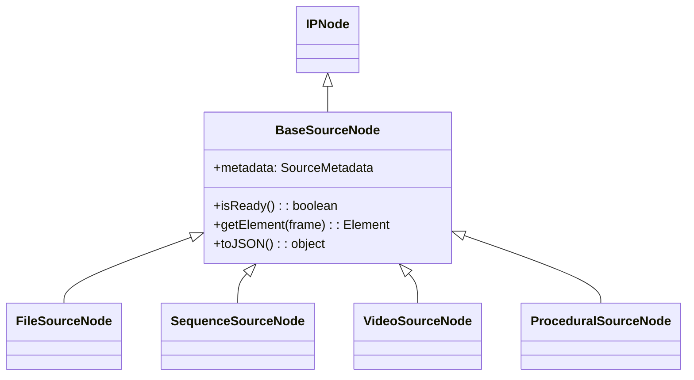
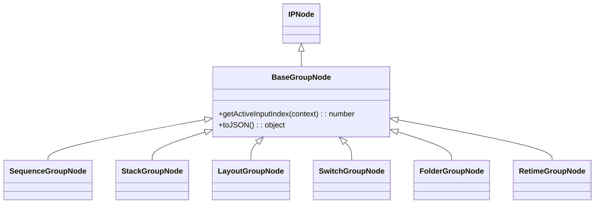
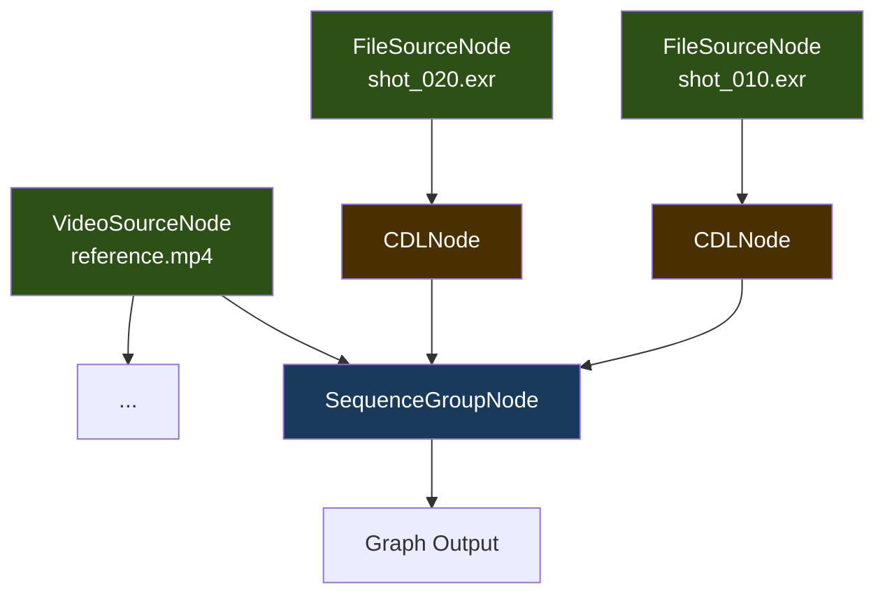
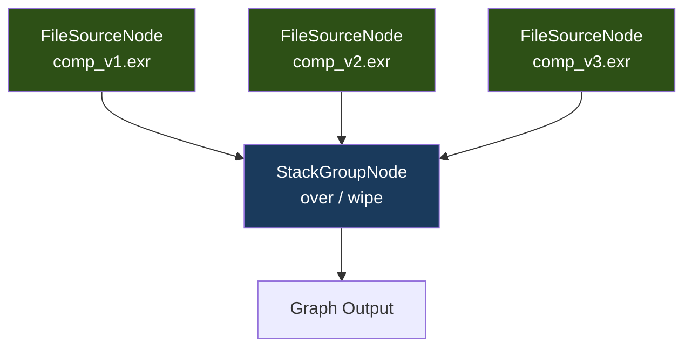
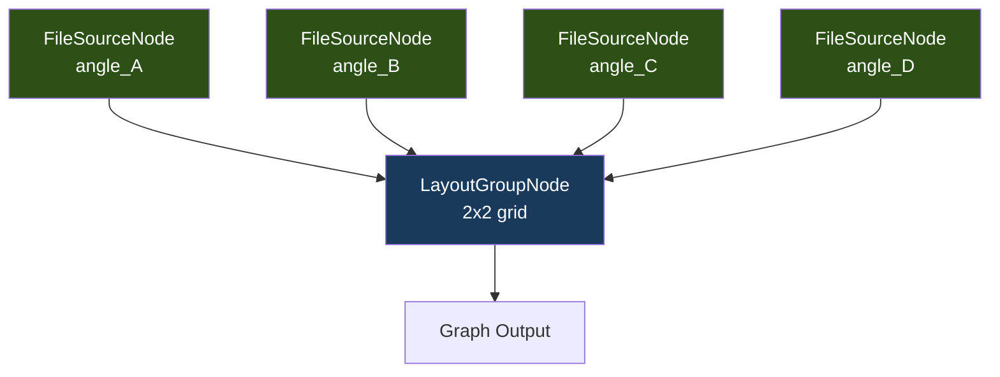

# Node Graph Architecture

> *Portions of this guide are adapted from [OpenRV Reference Manual, Chapter 2](https://github.com/AcademySoftwareFoundation/OpenRV), (c) Contributors to the OpenRV Project, Apache 2.0. Content has been rewritten for the TypeScript/WebGL2 implementation of OpenRV Web.*

---

## Overview

OpenRV Web uses a **Directed Acyclic Graph (DAG)** to represent the image processing pipeline. Every source, group, and effect in a session is a node in this graph. Connections between nodes define the flow of image data from sources (files, videos, sequences) through effects (color correction, sharpening, noise reduction) to group nodes (sequence, stack, layout) that determine how multiple sources are viewed.

The DAG model provides several advantages over a simple linear pipeline:

- **Flexible composition**: Multiple sources can be composited, compared, or arranged spatially
- **Shared processing**: A single source node can feed into multiple viewing arrangements without re-decoding
- **Lazy evaluation**: Only the active branch of the graph is evaluated for any given frame
- **Cached results**: Each node caches its output, preventing redundant computation when the graph is re-evaluated for the same frame

This guide covers the base node infrastructure, all node categories (source, group, effect), and the evaluation model.

---

## Core Infrastructure

### IPNode Base Class

All nodes in the graph inherit from `IPNode` (`src/nodes/base/IPNode.ts`). This abstract class provides:

```
IPNode
  +-- id: string              // Unique identifier (e.g., "RVFileSource_1")
  +-- type: string            // Node type for factory registration
  +-- name: string            // Human-readable label
  +-- properties: PropertyContainer
  +-- inputs: IPNode[]        // Upstream connections
  +-- outputs: IPNode[]       // Downstream connections
  +-- processor: NodeProcessor | null
  +-- evaluate(context) -> IPImage | null
  +-- process(context, inputs) -> IPImage | null  [abstract]
  +-- markDirty() / clearDirty()
  +-- connectInput(node) / disconnectInput(node)
  +-- dispose()
```

**Key behaviors:**

- **Unique IDs**: Generated automatically using a module-level counter with the pattern `{type}_{counter}`. After deserialization, the counter is reset to prevent collisions with subsequently created nodes.
- **Input/output management**: `connectInput()` establishes a bidirectional link -- the caller adds the node to its inputs, and the node adds the caller to its outputs. `disconnectInput()` removes both links.
- **Reordering**: `reorderInput(fromIndex, toIndex)` moves an input within the array, used by group nodes to support drag-and-drop reordering of children.
- **Dirty propagation**: When a node's properties change or its inputs change, `markDirty()` is called, which propagates downstream to all output nodes. This ensures that the next evaluation recomputes affected nodes.

### Evaluation Model

The `evaluate(context: EvalContext)` method implements a pull-based evaluation:

1. **Cache check**: If the node is not dirty and the cached frame matches `context.frame`, return the cached `IPImage`
2. **Input evaluation**: Recursively evaluate all input nodes, collecting their output images
3. **Processing**: Delegate to either an external `NodeProcessor` (if set) or the node's own `process()` method
4. **Cache update**: Store the result and clear the dirty flag

The `EvalContext` carries the current frame number, target resolution, and quality mode, allowing nodes to make resolution-aware decisions (e.g., extracting video frames at reduced resolution during interaction).

### PropertyContainer

The `PropertyContainer` class (`src/core/graph/Property.ts`) provides typed, observable property storage for nodes. Each property has:

- **Name and default value**: Properties are created with `add({ name, defaultValue, min?, max?, step?, label?, group? })`
- **Type-safe access**: `getValue<T>(name)` and `setValue(name, value)` with automatic clamping for numeric properties
- **Change signals**: The `propertyChanged` signal fires whenever a property value changes, propagating through the node's own `propertyChanged` signal
- **Keyframe animation**: Properties marked as `animatable` support keyframe-based animation with linear, step, and smooth interpolation modes
- **Serialization**: `toJSON()` and `fromJSON()` for session persistence

### Signal System

The `Signal<T>` class (`src/core/graph/Signal.ts`) implements a simple publish-subscribe pattern:

- **`connect(callback)`**: Subscribe to the signal. Returns an unsubscribe function
- **`emit(value, oldValue)`**: Notify all subscribers with the new and old values
- **`disconnectAll()`**: Remove all subscribers (used during disposal)

Signals are used throughout the node system for reactive change propagation: property changes, input connection changes, and output connection changes all use signals.

### NodeProcessor Strategy

The `NodeProcessor` interface enables external processing delegation:

```typescript
interface NodeProcessor {
  process(context: EvalContext, inputs: (IPImage | null)[]): IPImage | null;
  invalidate(): void;
  dispose(): void;
}
```

When a `NodeProcessor` is attached to a node via `node.processor = myProcessor`, the node delegates its `process()` call to the processor instead of using the built-in subclass implementation. This is used by:

- `StackProcessor`: GPU-accelerated multi-layer compositing
- `SwitchProcessor`: Optimized A/B switching
- `LayoutProcessor`: Tiled rendering with viewport management

### NodeFactory

The `NodeFactory` singleton (`src/nodes/base/NodeFactory.ts`) manages dynamic node creation:

- **Registration**: The `@RegisterNode('TypeName')` decorator registers a node class with a type string
- **Creation**: `NodeFactory.create('TypeName')` returns a new instance of the registered class
- **Introspection**: `getRegisteredTypes()` lists all registered type strings; `isRegistered(type)` checks availability

This factory pattern enables the GTO graph loader to reconstruct arbitrary node graphs from serialized session files without hardcoding type-to-class mappings.

### Graph Class

The `Graph` class (`src/core/graph/Graph.ts`) manages a collection of nodes and provides top-level evaluation:

- **`addNode(node)`** / **`removeNode(id)`**: Add or remove nodes from the graph
- **`setOutputNode(node)`**: Designate the output node whose evaluation produces the final image
- **`evaluate(frame)`**: Creates an `EvalContext` and evaluates the output node, triggering recursive pull evaluation through the DAG
- **`evaluateWithContext(context)`**: Evaluates with a caller-provided `EvalContext` for resolution-aware processing
- **`clear()`**: Removes all nodes and connections

The graph does not enforce DAG constraints at the connection level -- it is the responsibility of the application layer to avoid cycles. In practice, cycles cannot occur because source nodes reject inputs and group nodes only accept source or effect node outputs.

---

## Source Nodes

Source nodes produce images from external data. They have no inputs and serve as the root of processing chains. All source nodes extend `BaseSourceNode`.



### BaseSourceNode

`src/nodes/sources/BaseSourceNode.ts`

The abstract base class for all sources. Key properties:

- **`metadata`**: Contains name, width, height, duration (frames), and FPS
- **`connectInput()` override**: Logs a warning and does nothing -- source nodes cannot have inputs
- **`isReady()`**: Abstract method indicating whether the source is loaded
- **`getElement(frame)`**: Returns the underlying DOM element (`HTMLImageElement`, `HTMLVideoElement`, or `ImageBitmap`) for direct rendering

### FileSourceNode

`src/nodes/sources/FileSourceNode.ts` -- Registered as `RVFileSource`

Loads a single image file and provides it as source data. Supports all formats in the `DecoderRegistry`:

- **Format detection**: Uses file extension for initial routing, then falls back to magic byte detection via the `DecoderRegistry`
- **EXR features**: Multi-layer AOV selection, channel remapping, data/display window handling, multi-view stereo
- **DPX/Cineon**: Optional log-to-linear conversion with configurable parameters
- **Gainmap HDR**: JPEG, HEIC, and AVIF gainmap decoding with headroom extraction
- **RAW preview**: Embedded JPEG preview extraction with EXIF metadata
- **Transfer function propagation**: HDR metadata (transfer function, color primaries) is set on the output `IPImage` for correct renderer behavior

The node stores the decoded `IPImage` and returns it for every frame (single-frame source). For multi-view EXR files, it can decode specific views.

### SequenceSourceNode

`src/nodes/sources/SequenceSourceNode.ts` -- Registered as `RVSequenceSource`

Loads image sequences with frame-by-frame access and intelligent caching:

- **`loadFiles(files, fps)`**: Scans files to create a `SequenceInfo` structure with pattern, frame range, and per-frame data
- **Preload manager**: Uses `FramePreloadManager<ImageBitmap>` for direction-aware preloading
- **Playback support**: `setPlaybackDirection()`, `setPlaybackActive()`, and `updatePlaybackBuffer()` optimize preloading for forward/reverse playback vs. scrubbing
- **Properties**: `pattern` (filename pattern), `startFrame`, `endFrame`, `fps`

### VideoSourceNode

`src/nodes/sources/VideoSourceNode.ts` -- Registered as `RVVideoSource`

Loads video files with frame-accurate extraction:

- **Dual-path loading**: Always creates an `HTMLVideoElement` as fallback, then attempts `MediabunnyFrameExtractor` initialization for WebCodecs-based extraction
- **HDR pipeline**: Detects HLG/PQ transfer functions and BT.2020 primaries from video metadata. HDR frames use a separate LRU cache and `HDRFrameResizer` for display-resolution resizing
- **Codec detection**: Reports unsupported professional codecs (ProRes, DNxHD) with descriptive errors and transcoding guidance
- **Frame caching**: SDR frames use `FramePreloadManager<FrameResult>`; HDR frames use a dedicated `LRUCache<number, IPImage>` with a 500 MB memory budget
- **Properties**: `url`, `duration`, `fps`, `useMediabunny`, `codec`, `file`

### ProceduralSourceNode

`src/nodes/sources/ProceduralSourceNode.ts` -- Registered as `RVMovieProc`

Generates procedural test patterns without external files:

| Pattern | Description |
|---------|-------------|
| `smpte_bars` | SMPTE 75% color bars (7 bars) |
| `ebu_bars` | EBU 100% color bars (8 bars) |
| `color_chart` | Macbeth ColorChecker approximation (6x4 grid) |
| `gradient` | Linear luminance gradient (horizontal or vertical) |
| `solid` | Flat solid color fill |
| `checkerboard` | Alternating squares pattern |
| `grey_ramp` | Discrete stepped grey levels |
| `resolution_chart` | Alignment chart with crosshairs and frequency gratings |

Supports the `.movieproc` URL format for OpenRV session compatibility, including desktop OpenRV aliases (`smpte` -> `smpte_bars`, `ebu` -> `ebu_bars`, `checker` -> `checkerboard`, `colorchart` -> `color_chart`, `ramp` -> `gradient`).

All pattern values are sRGB-encoded, consistent with how `FileSourceNode` handles SDR 8-bit images.

---

## Group Nodes

Group nodes combine or select from multiple input sources. All group nodes extend `BaseGroupNode`, which provides a default `process()` implementation that selects one of its inputs based on `getActiveInputIndex()`.



### SequenceGroupNode

Registered as `RVSequenceGroup`

Plays inputs in sequence, with each input contributing frames sequentially. The group tracks frame offsets to determine which input is active for any given frame.

- **EDL support**: Explicit Edit Decision List data with per-cut source index, in-point, and out-point. EDL arrays are stored as node properties (`edlFrames`, `edlSources`, `edlIn`, `edlOut`)
- **Duration tracking**: `setInputDurations()` specifies per-input frame counts; `getTotalDuration()` returns the sum
- **Local frame mapping**: `getLocalFrame(context)` converts global frame numbers to source-relative frame numbers
- **Auto EDL mode**: When no explicit EDL is set, the group auto-generates frame mapping from input durations

This is the **default view mode** -- when sources are loaded into OpenRV Web, they are arranged in a sequence by default.

**EDL data structure**: Each EDL entry contains four values: the global frame number where the cut starts, the source index (which input), the in-point within the source (first frame to use), and the out-point (last frame to use). These are stored as four parallel arrays in node properties, matching the GTO format used by desktop OpenRV for session compatibility.

**Frame resolution**: When `getActiveInputIndex()` is called with a frame number, the node first checks for explicit EDL data. If present, it performs a reverse scan through the EDL entries to find the entry whose start frame is less than or equal to the current global frame. If no EDL is set, it falls back to cumulative duration offsets.

### StackGroupNode

Registered as `RVStackGroup`

Stacks/composites multiple inputs with per-layer blend modes, opacities, and visibility controls:

- **Composite types**: `replace`, `over` (Porter-Duff), `add`, `difference`, `-difference`, `dissolve`, `minus`, `topmost` -- matching OpenRV's blend mode enum
- **Per-layer settings**: Each input can have an independent blend mode, opacity (0-1), and visibility toggle
- **Wipe mode**: In wipe mode, a horizontal split reveals input[0] on one side and the composited result of all remaining inputs on the other
- **Stencil boxes**: Per-layer stencil boxes define visible regions in normalized 0-1 coordinates
- **GPU compositing**: `supportsGPUCompositing()` indicates whether the current composite type is supported by the GPU path (over, replace, add, difference)

### LayoutGroupNode

Registered as `RVLayoutGroup`

Arranges inputs in a grid or spatial layout:

- **Layout modes**: `row`, `column`, and grid arrangements with configurable `columns`, `rows`, and `spacing`
- **Tiled rendering**: When `setTiledMode(true)` is called, `evaluateAllInputs()` returns all input images with computed `TileViewport` regions for GPU tiled rendering
- **Viewport calculation**: Each tile's viewport is computed based on canvas dimensions, grid geometry, and spacing

### SwitchGroupNode

Registered as `RVSwitchGroup`

Displays one of its inputs based on `outputIndex`. This is the primary node type for A/B comparison workflows where the artist rapidly switches between different versions of a shot:

- **`setActiveInput(index)`**: Selects which input to display (clamped to valid range)
- **`toggle()`**: Cycles to the next input (wraps around)
- **Use cases**: Comparing VFX versions (v1 vs v2), reviewing before/after color grades, checking comp layers in isolation

The `SwitchProcessor` provides an optimized processing path that avoids evaluating non-active inputs, saving significant computation when the switch has many inputs.

### FolderGroupNode

Registered as `RVFolderGroup`

A logical container for organizing sources. Does not affect rendering -- always passes through its first input. Used for hierarchical session organization.

### RetimeGroupNode

Registered as `RVRetimeGroup`

Applies time remapping to its input with three priority-ordered modes:

1. **Explicit mapping** (`explicitActive`): A lookup table maps output frame numbers to input frame numbers, allowing arbitrary frame reordering
2. **Warp keyframe interpolation** (`warpActive`): Piecewise-linear speed ramps defined by keyframe positions and rates. The input frame is computed by integrating the rate curve using the trapezoidal rule
3. **Standard retime**: `scale` (speed multiplier), `offset` (frame shift), and optional `reverse` flag

---

## Effect Nodes

Effect nodes apply image processing operations. They are single-input, single-output: each takes an image from `input[0]`, applies a transformation, and returns the modified image.

### EffectNode Base Class

`src/nodes/effects/EffectNode.ts`

All effects inherit from `EffectNode`, which provides:

- **`enabled`**: Boolean toggle for bypassing the effect
- **`mix`**: Blend factor (0 = bypass, 1 = full effect). When mix < 1.0, the output is linearly blended with the input
- **`isIdentity()`**: Abstract method returning `true` when current parameters produce no change (used to skip processing entirely)
- **`applyEffect(context, input)`**: Abstract method implementing the actual pixel transformation
- **`category`**: One of `color`, `tone`, `spatial`, or `diagnostic` for UI grouping

**Alpha handling**: During mix blending, the alpha channel is preserved from the input image (not interpolated) to prevent corruption of premultiplied-alpha images.

### EffectChain

`src/nodes/effects/EffectChain.ts`

A convenience wrapper for a linear chain of `EffectNode` instances:

```
Source -> Effect[0] -> Effect[1] -> ... -> Effect[N] -> Output
```

- **`append(effect)`**: Adds an effect to the end of the chain
- **`insert(index, effect)`**: Inserts at a specific position
- **`remove(effect)`**: Removes an effect and re-wires the chain
- **`reorder(from, to)`**: Moves an effect within the chain
- **Serialization**: `toJSON()` / `fromJSON()` with `NodeFactory` for round-trip persistence

### Individual Effect Nodes

| Effect Node | Type | Category | Description |
|-------------|------|----------|-------------|
| `CDLNode` | `RVCDL` | color | ASC CDL (Slope, Offset, Power + Saturation) per-channel |
| `ClarityNode` | `RVClarity` | spatial | Local contrast enhancement |
| `ColorInversionNode` | `RVColorInversion` | color | RGB channel inversion (negative image) |
| `ColorWheelsNode` | `RVColorWheels` | color | Lift/Gamma/Gain color wheels |
| `DeinterlaceNode` | `RVDeinterlace` | spatial | Field-based deinterlacing |
| `FilmEmulationNode` | `RVFilmEmulation` | tone | Film stock emulation via built-in 3D LUTs |
| `HighlightsShadowsNode` | `RVHighlightsShadows` | tone | Highlight recovery and shadow boost |
| `HueRotationNode` | `RVHueRotation` | color | Hue rotation in degrees |
| `NoiseReductionNode` | `RVNoiseReduction` | spatial | Spatial noise reduction |
| `SharpenNode` | `RVSharpen` | spatial | Unsharp mask sharpening |
| `StabilizationNode` | `RVStabilization` | spatial | Image stabilization (translate/rotate/scale) |
| `ToneMappingNode` | `RVToneMapping` | tone | Reinhard, Filmic, and ACES tone mapping |
| `VibranceNode` | `RVVibrance` | color | Selective saturation with skin tone protection |

**Effect ordering**: The order of effects in an `EffectChain` matters because operations are non-commutative. For example, applying CDL before tone mapping produces different results than the reverse. The chain's `reorder()` method allows artists to adjust effect order, and the serialization format preserves this order for session persistence.

**Contrast with desktop OpenRV**: Desktop OpenRV uses Mu and Python scripting to define custom image processing operations that can be inserted into the pipeline. OpenRV Web replaces this scripting model with a fixed set of TypeScript `EffectNode` subclasses. While this limits arbitrary extensibility, it provides type safety, better performance (no interpreter overhead), and deterministic behavior across sessions.

### GPU Processors

Two effects have dedicated GPU processor implementations for real-time performance:

- **`GPUNoiseReductionProcessor`**: WebGL2 shader-based spatial noise reduction
- **`GPUSharpenProcessor`**: WebGL2 shader-based unsharp mask

These processors are attached to their respective nodes via the `NodeProcessor` strategy pattern.

### GPU Processors

Two effects have dedicated GPU processor implementations for real-time performance:

- **`GPUNoiseReductionProcessor`** (`src/nodes/effects/processors/GPUNoiseReductionProcessor.ts`): WebGL2 shader-based spatial noise reduction that operates directly on GPU textures, avoiding the CPU round-trip required by the default `NoiseReductionNode.applyEffect()` path. Uses a bilateral filter kernel for edge-preserving denoising.
- **`GPUSharpenProcessor`** (`src/nodes/effects/processors/GPUSharpenProcessor.ts`): WebGL2 shader-based unsharp mask that computes the Laplacian of the input image in a single shader pass. The sharpening amount and radius are controlled by node properties.

These processors are attached to their respective nodes via the `NodeProcessor` strategy pattern, and are activated when the rendering backend detects WebGL2 availability.

### CacheLUTNode

`src/nodes/CacheLUTNode.ts`

A specialized node for applying pre-cache LUT transforms in the node graph. Positioned between the source and the rendering pipeline, it applies a 3D LUT transformation to the image data before caching, corresponding to the pre-cache LUT slot in the rendering pipeline. This node is distinct from the fragment shader LUT pipeline -- it operates on CPU-side pixel data and stores the transformed result for subsequent GPU upload.

### Effect Processing Model

When an effect chain processes an image, the following sequence occurs for each active effect:

1. **Identity check**: If `isIdentity()` returns true, the effect is skipped entirely (zero cost)
2. **Enabled check**: If `enabled` is false, the input is passed through unchanged
3. **Apply effect**: The `applyEffect()` method creates a modified copy of the input image. The current implementation uses `deepClone()` to create a new Float32Array buffer for each active effect
4. **Mix blending**: If `mix < 1.0`, the output is linearly interpolated with the input. Alpha channels are preserved from the input to avoid corrupting premultiplied-alpha images
5. **Cache update**: The result is stored in the node's cache for the current frame

**Performance considerations**: For HD uint8 workflows (the majority use case), the per-effect clone overhead is negligible. For 4K float32 workflows (~127 MB per clone), a chain of 5 active effects allocates ~635 MB of transient buffers. A ping-pong buffer optimization is planned for this scenario.

---

## DAG Topology

A typical session graph looks like this:



For a stack (comparison) view:



For a layout (grid) view:



### Contrast with Desktop OpenRV

Desktop OpenRV uses a similar DAG architecture but with important differences:

| Aspect | Desktop OpenRV | OpenRV Web |
|--------|---------------|------------|
| Language | C++ with Mu/Python scripting | TypeScript |
| Node registration | Compiled plugin system | `@RegisterNode` decorator + `NodeFactory` |
| Property system | GTO-native property types | `PropertyContainer` with `Signal` change notifications |
| Effect extensibility | Mu/Python scripts + GLSL | `EffectNode` subclass + optional `NodeProcessor` for GPU |
| Graph evaluation | Multi-threaded pull evaluation | Single-threaded pull with frame-level caching |
| Compositing | GPU-only (OpenGL) | CPU fallback with GPU path for supported blend modes |
| Session format | GTO binary (native read/write) | GTO binary (read via `gto-js`), JSON `.orvproject` (native read/write) |
| Procedural sources | `.movieproc` URL format | `.movieproc` URL format (compatible) |
| Node disposal | Reference-counted GC | Explicit `dispose()` with signal cleanup |

### Graph Lifecycle

Nodes must be explicitly disposed when removed from the graph. The `dispose()` method on `IPNode`:

1. Disconnects all inputs and outputs (breaking bidirectional links)
2. Disposes the `PropertyContainer` (cleaning up property change signals)
3. Disconnects all signals (`inputsChanged`, `outputsChanged`, `propertyChanged`)
4. Clears the cached image reference
5. Disposes any attached `NodeProcessor`

Source nodes have additional cleanup responsibilities: `VideoSourceNode` revokes blob URLs and disposes the mediabunny extractor; `SequenceSourceNode` disposes the preload manager and closes loaded `ImageBitmap` objects; `ProceduralSourceNode` releases the cached `IPImage`.

---

## Related Pages

- [File Formats](file-formats.md) -- Format decoders used by `FileSourceNode` and `VideoSourceNode`
- [Session Compatibility](session-compatibility.md) -- How GTO sessions map to the node graph
- [Stereo 3D Viewing](stereo-3d-viewing.md) -- Stereo source pair representation in the DAG
