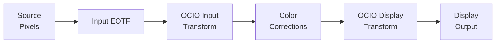
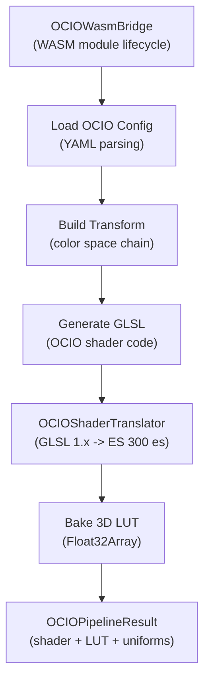

# OCIO Color Management

> **Attribution:** Portions of this guide are adapted from
> [OpenRV](https://github.com/AcademySoftwareFoundation/OpenRV) documentation,
> Copyright Contributors to the OpenRV Project, Apache License 2.0.
> Content has been rewritten for OpenRV Web's browser-based WebGL2 architecture.
> See [ATTRIBUTION.md](../ATTRIBUTION.md) for full details.

> **Implementation Status: Partially Implemented.** OpenRV Web's OCIO support
> is functional for built-in configurations and basic color space transforms.
> WASM-based native OCIO processing, custom config loading, and some advanced
> features are implemented but may have limitations compared to the desktop
> OpenRV OCIO integration. Sections marked with **(Planned)** describe
> features that are not yet fully operational. Workflow examples (Section 5)
> are deferred until OCIO reaches full implementation status.

---

## 1. Concepts

### What is OCIO?

OpenColorIO (OCIO) is an open-source color management framework maintained by the Academy Software Foundation. It provides a standardized way to define and apply color space transforms across all applications in a VFX/animation pipeline. When every tool in the pipeline uses the same OCIO configuration, colors are guaranteed to be consistent from on-set capture through final delivery.

OCIO introduces several core concepts:

- **Color Space**: A named definition of how pixel values map to physical or perceptual color. Examples: ACEScg (scene-linear, AP1 primaries), sRGB (display-referred), ARRI LogC3 (camera log).
- **Working Space**: The color space in which grading and compositing operations take place. Typically scene-linear (e.g., ACEScg or Linear sRGB).
- **Display**: Represents a physical output device (e.g., an sRGB monitor, a DCI-P3 projector, a Rec.2020 HDR TV).
- **View**: A transform applied on top of the display transform that defines how the working space maps to the display (e.g., "ACES 1.0 SDR-video", "Raw", "Log").
- **Look**: An optional creative transform applied between the working space and the display transform (e.g., a show-specific look, a film emulation).

### OCIO in OpenRV Web vs Desktop OpenRV

| Aspect | OpenRV (Desktop) | OpenRV Web |
|--------|-----------------|------------|
| OCIO Version | v2 with legacy v1 API | WASM-compiled OCIO v2, with JS fallback |
| Config Loading | `$OCIO` environment variable, file path | File picker, drag-and-drop, built-in configs |
| Node Types | OCIONode, OCIOFile, OCIODisplay, OCIOLook | Unified `OCIOProcessor` with state machine |
| GPU Path | Native C++ GLSL generation | WASM GLSL generation + shader translation |
| LUT Integration | Direct GPU texture upload | 3D LUT baking via `OCIOPipelineResult` |
| Per-Source Control | All sources use same OCIO display | Selective per-source OCIO application |

---

## 2. Configuration Loading

### Built-in Configurations

OpenRV Web ships with built-in OCIO configurations that can be used without loading any external files:

**ACES 1.2** (`aces_1.2`):
- Color spaces: ACES2065-1, ACEScg, ACEScct, ACEScc, Linear sRGB, sRGB, Rec.709, ARRI LogC3 (EI 800), ARRI LogC4, Sony S-Log3, RED Log3G10, DCI-P3, Rec.2020, Adobe RGB, ProPhoto RGB, Raw
- Displays: sRGB, Rec.709, DCI-P3, Rec.2020
- Views: ACES 1.0 SDR-video, Raw, Log
- Looks: None, ACES 1.0, Filmic

**sRGB Studio** (`srgb`):
- Color spaces: Linear sRGB, sRGB, Rec.709, Raw
- Displays: sRGB, Rec.709
- Views: Standard, Raw
- Looks: None

Built-in configurations are accessed through the API without file loading:

```typescript
import { getBuiltinConfig, getAvailableConfigs } from './color/OCIOConfig';

// List available configs
const configs = getAvailableConfigs();
// [{ name: 'aces_1.2', description: 'Academy Color Encoding System 1.2' },
//  { name: 'srgb', description: 'Simple sRGB workflow' }]

// Get a specific config
const aces = getBuiltinConfig('aces_1.2');
```

### Loading Custom Configurations

**(Partially Implemented)**

Custom OCIO configurations can be loaded via file picker or drag-and-drop:

1. Drag an `.ocio` configuration file onto the viewer, or use the file picker in the OCIO panel.
2. The configuration is parsed and validated.
3. If valid, the configuration's color spaces, displays, views, and looks become available in the OCIO panel dropdowns.

**Custom config registration:**

```typescript
import { registerCustomConfig, removeCustomConfig } from './color/OCIOConfig';

// Register a parsed custom config
registerCustomConfig({
  name: 'studio_config',
  version: '1.0',
  description: 'Studio custom config',
  colorSpaces: [...],
  displays: [...],
  looks: [...],
  roles: { default: 'sRGB', reference: 'ACES2065-1', colorPicking: 'sRGB', data: 'Raw' },
});

// Remove it later
removeCustomConfig('studio_config');
```

### Configuration Parsing

The `OCIOConfigParser` (`src/color/OCIOConfigParser.ts`) parses OCIO configuration YAML files and produces `OCIOConfigDefinition` objects. Validation includes:

- Required sections: `colorspaces`, `displays`, `views`, `roles`
- Color space encoding type detection (scene-linear, log, sdr-video, data)
- Display/view relationship validation
- Role mapping verification

### Browser Limitations for Config Loading

Unlike desktop OpenRV, which reads the OCIO configuration from the `$OCIO` environment variable or a filesystem path, OpenRV Web operates in a browser sandbox:

- **No `$OCIO` environment variable**: Browsers do not expose environment variables. Configurations must be loaded explicitly.
- **No filesystem access for referenced files**: OCIO configurations often reference external LUT files by relative path. In the browser, all referenced files must be loaded together (e.g., in a ZIP archive) or embedded in the configuration. **(Planned: ZIP bundle loading)**
- **Config persistence**: The active configuration is stored in session state and persists across page reloads via the session serialization system.

---

## 3. Transform Pipeline

### OCIO State Machine

The `OCIOProcessor` (`src/color/OCIOProcessor.ts`) manages the complete OCIO state as an `OCIOState` object:

```typescript
interface OCIOState {
  enabled: boolean;
  configName: string;
  customConfigPath: string | null;
  inputColorSpace: string;          // Source color space
  detectedColorSpace: string | null; // Auto-detected from metadata
  workingColorSpace: string;         // Where grading happens
  display: string;                   // Output display device
  view: string;                      // View transform
  look: string;                      // Creative look
  lookDirection: 'forward' | 'inverse';
}
```

### Transform Chain

The OCIO pipeline applies transforms at two points in the fragment shader:



**Input Transform** (after EOTF, before color corrections):
Converts from the source color space to the working color space. For example: ARRI LogC3 to ACEScg.

**Display Transform** (after tone mapping/gamut mapping, before display transfer):
Converts from the working color space through the display/view/look transforms to the display's expected encoding. For example: ACEScg through ACES 1.0 SDR-video to sRGB.

### Input Color Space Auto-Detection

The `OCIOProcessor` can automatically detect the input color space from file metadata:

| Metadata Source | Detection Method |
|----------------|-----------------|
| File extension | `.dpx`/`.cin` -> ACEScct, `.exr` -> Linear sRGB, `.arw` -> Sony S-Log3, `.ari` -> ARRI LogC3, `.r3d` -> RED Log3G10 |
| EXR chromaticities | Matches chromaticity coordinates against known primaries |
| Color primaries metadata | Maps container metadata to OCIO color space names |
| Transfer characteristics | Detects PQ, HLG, log encoding from container metadata |

When `inputColorSpace` is set to "Auto", the auto-detected space is used. The detected space is stored in `OCIOState.detectedColorSpace` for display in the UI.

### API for Querying Transforms

```typescript
import {
  getInputColorSpaces,
  getWorkingColorSpaces,
  getDisplays,
  getViewsForDisplay,
  getLooks,
} from './color/OCIOConfig';

// Query available options for the ACES 1.2 config
const inputs = getInputColorSpaces('aces_1.2');
// ['Auto', 'ACES2065-1', 'ACEScg', 'ACEScct', ...]

const workSpaces = getWorkingColorSpaces('aces_1.2');
// ['ACES2065-1', 'ACEScg', 'Linear sRGB', 'ProPhoto RGB']

const displays = getDisplays('aces_1.2');
// ['sRGB', 'Rec.709', 'DCI-P3', 'Rec.2020']

const views = getViewsForDisplay('aces_1.2', 'sRGB');
// ['ACES 1.0 SDR-video', 'Raw', 'Log']

const looks = getLooks('aces_1.2');
// ['None', 'ACES 1.0', 'Filmic']
```

### Comparison: OpenRV OCIO Nodes vs OpenRV Web

| OpenRV Node | Purpose | OpenRV Web Equivalent |
|------------|---------|----------------------|
| `OCIONode` | Generic color space conversion | `OCIOTransform.convertColorSpace()` |
| `OCIOFile` | File-to-working-space conversion | `OCIOProcessor` input transform |
| `OCIODisplay` | Working-to-display conversion | `OCIOProcessor` display transform |
| `OCIOLook` | Creative look application | `OCIOProcessor` look parameter |

OpenRV Web unifies these four node types into a single `OCIOProcessor` with a state-driven API, reducing complexity while maintaining the same transform capabilities.

---

## 4. WASM Processing Pipeline

### Architecture

The WASM pipeline (`src/color/wasm/OCIOWasmPipeline.ts`) provides native OCIO processing in the browser:



The pipeline operates in three modes:

- **WASM** (`OCIOPipelineMode = 'wasm'`): Full native OCIO processing through the WASM module. Generates both a translated GLSL shader snippet and a baked 3D LUT.
- **Baked** (`OCIOPipelineMode = 'baked'`): Uses only the baked 3D LUT for the transform. Falls back to this mode when WASM shader generation fails.
- **Off** (`OCIOPipelineMode = 'off'`): OCIO pipeline disabled. Uses the built-in JS transform path.

### OCIOPipelineResult

When a transform is built, the pipeline produces an `OCIOPipelineResult`:

```typescript
interface OCIOPipelineResult {
  shader: TranslatedShader;    // GLSL ES 300 es function snippet
  lut3D: LUT3D;                // Baked 3D LUT (Float32Array RGB)
  uniforms: UniformInfo[];     // Uniform metadata from OCIO shader
  functionName: string;        // OCIO function entry point name
  fromWasm: boolean;           // true if from WASM, false if JS fallback
}
```

The renderer consumes this result by either:
1. Injecting the translated shader code and uploading the LUT texture (WASM mode), or
2. Uploading only the baked 3D LUT to one of the three LUT slots (baked/JS mode).

### Shader Translation

OCIO generates GLSL 1.x shader code. Since OpenRV Web uses WebGL2 (GLSL ES 3.00), the `OCIOShaderTranslator` (`src/color/wasm/OCIOShaderTranslator.ts`) performs the following translations:

- Converts `texture2D()`/`texture3D()` calls to `texture()`.
- Adds `precision` qualifiers.
- Converts varying/attribute qualifiers to in/out.
- Handles `#version` directive injection.
- Extracts and catalogs uniform declarations.

### Virtual Filesystem

The WASM module operates in a sandboxed environment without access to the browser's filesystem. The `OCIOVirtualFS` (`src/color/wasm/OCIOVirtualFS.ts`) provides an in-memory filesystem that:

- Stores OCIO config files and referenced LUT files in memory.
- Maps virtual paths to ArrayBuffer contents.
- Enables the WASM OCIO module to load configs and LUTs as if reading from a filesystem.

### LUT Baking

When WASM generates a complete transform chain, it bakes the result into a 3D LUT for GPU consumption. The default LUT size is 65 (65x65x65 = 274,625 lattice points), which provides sufficient precision for most transforms. The baking process:

1. Iterates over every lattice point in the 3D grid.
2. Passes each (R,G,B) triplet through the OCIO transform chain.
3. Stores the output in a `Float32Array` with RGB interleaving.
4. Wraps the result as a `LUT3D` object compatible with the renderer's LUT slots.

The baked LUT can be assigned to any of the three LUT slots (file, look, or display), depending on where in the pipeline the OCIO transform should be applied.

### Event System

The OCIO pipeline components emit events for reactive UI updates:

| Event | Source | Description |
|-------|--------|-------------|
| `stateChanged` | `OCIOProcessor` | OCIO state updated (config, color space, display, view, look) |
| `transformChanged` | `OCIOProcessor` | Active transform chain rebuilt |
| `perSourceColorSpaceChanged` | `OCIOProcessor` | Per-source color space override changed |
| `processingModeChanged` | `OCIOProcessor` | Processing mode switched (JS <-> WASM) |
| `modeChanged` | `OCIOWasmPipeline` | Pipeline mode changed (wasm/baked/off) |
| `pipelineReady` | `OCIOWasmPipeline` | New pipeline result available |
| `error` | `OCIOWasmPipeline` | Non-fatal error (pipeline degrades gracefully) |

### Processing Modes

The `OCIOProcessor` supports two processing modes:

- **JS mode** (`OCIOProcessingMode = 'js'`): Uses the built-in `OCIOTransform` class for color space conversion. Suitable for simple transforms and built-in configurations.
- **WASM mode** (`OCIOProcessingMode = 'wasm'`): Uses the `OCIOWasmPipeline` for full native OCIO processing. Required for custom configs with complex transforms (FileTransform, GroupTransform, etc.).

The processor automatically falls back from WASM to JS mode if the WASM module fails to load or if a transform cannot be processed by WASM.

---

## 5. Browser Limitations vs Desktop OCIO

### No Environment Variable Support

Desktop applications locate the OCIO configuration via the `$OCIO` environment variable. Browsers do not expose environment variables. OpenRV Web requires explicit configuration loading through:

- Built-in configuration selection
- File picker or drag-and-drop
- Programmatic loading via the API

### External File References

OCIO configurations commonly reference external LUT files via relative paths (e.g., `luts/sRGB_to_linear.spi1d`). In the browser:

- All referenced files must be loaded into the virtual filesystem before the config can be used.
- **(Planned)**: ZIP bundle loading that automatically extracts and registers all referenced files.
- Self-contained configurations (no external file references) work without additional setup.

### WASM Module Considerations

- **Module size**: The OCIO WASM module adds approximately 2-3 MB to the application bundle (gzipped).
- **Load time**: Initial WASM compilation and instantiation takes 100-500ms depending on the device.
- **Memory**: Each loaded configuration and its associated LUTs consume WASM heap memory.

### GPU Shader Differences

- OCIO generates GLSL 1.x shader code; translation to GLSL ES 3.00 may not support all OCIO operators.
- Precision differences between WASM float processing and GPU float processing are typically negligible but may be observable in extreme cases.
- Custom OCIO operators (user-defined C++ transforms) are not supported in the WASM build.

### Auto-Detection Differences

- Desktop OpenRV uses the `ocio_source_setup` package system for automatic color space assignment based on file metadata and pipeline conventions.
- OpenRV Web builds auto-detection into the `OCIOProcessor` directly, using file extension mapping and metadata inspection. The detection logic is simpler but covers the most common VFX file types.

### Per-Source OCIO

Unlike the original OpenRV, where activating OCIO display transforms applies to all imagery globally, OpenRV Web supports **selective per-source OCIO application**. Each source can have:

- An independent input color space override (`perSourceColorSpace` map in `OCIOProcessor`).
- The ability to opt out of OCIO entirely while other sources use it.

This is particularly useful when reviewing mixed-format dailies (e.g., ARRI LogC3 alongside RED Log3G10 footage with different IDT requirements).

### Feature Support Summary

| Feature | Desktop OpenRV | OpenRV Web |
|---------|---------------|------------|
| Built-in configs | No (requires $OCIO) | Yes (ACES 1.2, sRGB) |
| Custom configs | Yes ($OCIO env var) | Yes (file picker, drag-and-drop) |
| FileTransform (external LUTs) | Yes (filesystem) | Partial (requires pre-loading) |
| GroupTransform | Yes | Yes (WASM mode) |
| MatrixTransform | Yes | Yes |
| LogTransform | Yes | Yes |
| ExponentTransform | Yes | Yes |
| CDLTransform | Yes | Yes |
| Custom operators | Yes (C++ plugins) | No |
| Per-source color space | No (global display) | Yes |
| GPU shader path | Native C++ GLSL | WASM GLSL + translation |
| Baked 3D LUT fallback | No | Yes |
| Config persistence | Filesystem | Session state (IndexedDB) |

---

## 6. Workflow Examples

> **DEFERRED.** Workflow examples are deferred until OCIO reaches full
> implementation status. Writing workflow examples against a partially
> implemented feature would produce documentation that may not accurately
> reflect the final behavior. The following workflows are planned:
>
> - **Basic ACES Workflow**: Load EXR, auto-detect ACEScg, view through ACES Output Transform.
> - **Loading a Studio OCIO Config**: Import a custom `.ocio` file with referenced LUTs.
> - **Switching Display/View Transforms**: Review the same footage for different delivery targets (SDR monitor, HDR TV, cinema projector).
> - **Using Look Transforms**: Apply show-specific creative grades via OCIO looks.
> - **Combining OCIO with Manual Corrections**: Layer CDL, curves, and color wheels on top of OCIO-managed color spaces.

---

## Related Pages

- [Rendering Pipeline](rendering-pipeline.md) -- OCIO's position in the full shader pipeline
- [LUT System](lut-system.md) -- OCIO generates 3D LUTs consumed by the LUT pipeline
- [CDL Color Correction](cdl-color-correction.md) -- CDL operates within the OCIO-managed working space
