# Rendering Pipeline

> **Attribution:** Portions of this guide are adapted from
> [OpenRV](https://github.com/AcademySoftwareFoundation/OpenRV) documentation,
> Copyright Contributors to the OpenRV Project, Apache License 2.0.
> Content has been rewritten for OpenRV Web's browser-based WebGL2 architecture.
> See [ATTRIBUTION.md](../ATTRIBUTION.md) for full details.

---

## Overview

OpenRV Web transforms pixels from file-encoded source data to display-referred output through a single-pass WebGL2 fragment shader pipeline. Every color correction, transfer function conversion, and diagnostic overlay executes in one draw call, eliminating the multi-pass overhead found in CPU-based pipelines.

The original OpenRV uses a split architecture: a software "pre-cache" stage running on the CPU followed by GPU "post-cache" stages in the OpenGL shader. OpenRV Web collapses this entire pipeline into a unified fragment shader (`viewer.frag.glsl`) that processes approximately 40 distinct stages in linear sequence. All corrections operate in linear light unless otherwise noted.

### Design Principles

- **Linear light processing.** Source data is linearized via the appropriate EOTF before any color correction. All grading math (exposure, saturation, contrast, CDL) operates on scene-referred linear values.
- **Single-pass GPU execution.** The fragment shader evaluates every enabled stage per fragment, per frame. Disabled stages compile to no-ops via uniform branching and are effectively free.
- **HDR-aware throughout.** The pipeline preserves values above 1.0 (super-whites) until the final output clamp. HDR headroom is propagated through tone mapping and display stages.
- **Modular stage ordering.** Each stage reads from and writes to the same `color` variable, allowing stages to be enabled independently without recompilation.

---

## Full Pipeline Diagram

The following diagram shows the complete stage ordering as implemented in the fragment shader. Stages are numbered to match the shader source comments.

```mermaid
flowchart TD
    A["Texture Sample"] --> B["0a. Deinterlace"]
    B --> C["0a2. Perspective Correction"]
    C --> D["0a3. Spherical Projection"]
    D --> E["0b. Channel Swizzle"]
    E --> F["0b2. Unpremultiply Alpha"]
    F --> G["0c. Linearize (Log/Gamma/sRGB/Rec.709)"]
    G --> H["0d. Input EOTF (HLG / PQ / SMPTE 240M)"]
    H --> I{"File LUT\nenabled?"}
    I -- Yes --> J["0e-alt. File LUT 3D"]
    I -- No --> K["0e. Input Primaries"]
    J --> L["1. Exposure"]
    K --> L
    L --> M["1a. Per-Channel Scale/Offset"]
    M --> N["1b. Inline 1D LUT"]
    N --> O["2. Temperature / Tint"]
    O --> P["3. Brightness"]
    P --> Q["4. Contrast"]
    Q --> R["5. Saturation"]
    R --> S["5b. Highlights / Shadows / Whites / Blacks"]
    S --> T["5c. Vibrance"]
    T --> U["5d. Hue Rotation"]
    U --> V["5e. Clarity"]
    V --> W["6a. Color Wheels (Lift/Gamma/Gain)"]
    W --> X["6b. CDL (SOP + Saturation)"]
    X --> Y["6c. Curves (1D LUT)"]
    Y --> Z["6d. Look LUT 3D"]
    Z --> AA["6e. HSL Qualifier"]
    AA --> AB["6f. Film Emulation"]
    AB --> AC["6g. Out-of-Range Visualization"]
    AC --> AD["7. Tone Mapping"]
    AD --> AE["7a. Gamut Mapping"]
    AE --> AF["7b. Sharpen"]
    AF --> AG["7c. Output Primaries"]
    AG --> AH["7d. Display LUT 3D"]
    AH --> AI["8a. Display Transfer Function"]
    AI --> AJ["8b. Creative Gamma"]
    AJ --> AK["8c. Display Gamma Override"]
    AK --> AL["8d. Display Brightness"]
    AL --> AM["9. Color Inversion"]
    AM --> AN["10. Channel Isolation"]
    AN --> AO["11. False Color"]
    AO --> AP["11b. Contour Iso-Lines"]
    AP --> AQ["12. Zebra Stripes"]
    AQ --> AR["12c. Dither + Quantize"]
    AR --> AS["Final Output (SDR Clamp / HDR Pass)"]
```



### Comparison: OpenRV vs OpenRV Web Pipeline

| Aspect | OpenRV (Desktop) | OpenRV Web |
|--------|-----------------|------------|
| Architecture | CPU pre-cache + GPU post-cache | Single GPU fragment shader |
| Linearization | CPU-side with YUV/YRyBy | GPU-side EOTF; browser handles YUV decode |
| LUT Slots | Pre-Cache (CPU), File, Look, Display | File LUT, Look LUT, Display LUT (all GPU) |
| Color Corrections | Exposure, saturation, hue rotation | Extended: + temp/tint, brightness, vibrance, clarity, color wheels, CDL, HSL qualifier, highlights/shadows, curves, film emulation |
| Tone Mapping | None (linear display assumed) | 9 operators: Reinhard, Filmic, ACES, AgX, PBR Neutral, GT, ACES Hill, Drago, Off |
| HDR Output | Not supported | HLG, PQ, Extended (via drawingBufferColorSpace) |
| OCIO | v2 native C++ | WASM-compiled, with JS fallback |
| Scripting | Mu / Python for custom stages | Shader-defined; extensible via uniform injection |

---

## Uniform Architecture

The uniform management layer is implemented by `ShaderStateManager` (`src/render/ShaderStateManager.ts`), which has been split into focused modules for maintainability:

- **`ShaderConstants.ts`**: Dirty flags, operator codes, and constant matrices.
- **`ShaderStateTypes.ts`**: The `InternalShaderState` interface, state factory, and helper functions.
- **`ShaderUniformUploader.ts`**: The `applyUniforms()` function that uploads state to GL uniform locations.
- **`ShaderBatchApplicator.ts`**: The `applyRenderState()` function that batches high-level render state into uniform updates.

The fragment shader communicates with the TypeScript renderer through a comprehensive set of uniforms. Each stage has one or more uniforms that control its behavior. Boolean-guarded stages (`u_cdlEnabled`, `u_colorWheelsEnabled`, etc.) compile to simple uniform branches that the GPU's branch predictor handles efficiently -- disabled stages add negligible cost.

Key uniform categories:

- **Per-channel vec3 uniforms** (`u_exposureRGB`, `u_contrastRGB`, `u_gammaRGB`, `u_scaleRGB`, `u_offsetRGB`): Allow independent per-channel control. When the user moves a single slider, all three components are set to the same value.
- **Matrix uniforms** (`u_hueRotationMatrix`, `u_inputPrimariesMatrix`, `u_outputPrimariesMatrix`, `u_perspectiveInvH`): Precomputed on the CPU and uploaded as `mat3` uniforms. This avoids expensive matrix construction in the shader.
- **Texture uniforms** (`u_fileLUT3D`, `u_lookLUT3D`, `u_displayLUT3D`, `u_curvesLUT`, `u_falseColorLUT`, `u_filmLUT`, `u_inlineLUT`): Lookup tables and curve data stored as GPU textures for hardware-accelerated sampling.
- **Integer selectors** (`u_toneMappingOperator`, `u_inputTransfer`, `u_displayTransfer`, `u_channelMode`, `u_outputMode`): Integer enums that select between algorithmic variants via `if/else if` chains.

---

## Stage-by-Stage Reference

### Stage 0a: Deinterlace

Interlaced video fields are reconstructed before any color processing. Three methods are available:

- **Bob** (`u_deinterlaceMethod == 0`): Interpolates the missing field by averaging the rows above and below.
- **Weave** (`u_deinterlaceMethod == 1`): Passes through both fields without modification.
- **Blend** (`u_deinterlaceMethod == 2`): Averages each row with its nearest neighbor from the opposite field.

Field order is configurable: top-field-first (TFF) or bottom-field-first (BFF) via `u_deinterlaceFieldOrder`.

### Stage 0a2: Perspective Correction

Applies a homography warp for keystone or lens correction. The inverse homography matrix (`u_perspectiveInvH`) maps output coordinates back to source texture coordinates. Two interpolation modes are supported:

- **Bilinear** (`u_perspectiveQuality == 0`): Hardware texture sampling. Fast, suitable for small corrections.
- **Bicubic** (`u_perspectiveQuality == 1`): Catmull-Rom 4x4 kernel. Higher quality for large geometric transforms.

Out-of-bounds samples produce transparent black.

### Stage 0a3: Spherical Projection

For equirectangular (360-degree) content, this stage computes a virtual camera ray from the screen-space UV coordinates and maps it to equirectangular texture coordinates. The projection supports:

- **Field of view** (`u_sphericalFov`): Horizontal FOV in radians.
- **Yaw/Pitch** (`u_sphericalYaw`, `u_sphericalPitch`): Camera orientation in radians.
- **Aspect ratio** (`u_sphericalAspect`): Canvas width/height ratio.

Pole stabilization prevents UV noise artifacts near the poles by smoothly blending the longitude coordinate toward a stable center value.

### Stage 0b: Channel Swizzle

Remaps input channels before color processing. The `u_channelSwizzle` uniform is an `ivec4` where each component selects the source channel for that output position:

| Value | Source |
|-------|--------|
| 0 | Red |
| 1 | Green |
| 2 | Blue |
| 3 | Alpha |
| 4 | Constant 0.0 |
| 5 | Constant 1.0 |

Default is `ivec4(0, 1, 2, 3)` (identity). This stage implements the same channel remapping as OpenRV's `RVChannelMap` node.

### Stage 0b2: Unpremultiply Alpha

When `u_premult == 2`, divides RGB by alpha to recover straight (unassociated) alpha. This must occur before linearization so that all subsequent color math operates on straight-alpha values. Skipped when alpha is near zero (< 1e-5) to avoid division artifacts, and when channel isolation mode is active.

---

## Linearization and EOTF

The linearization system converts file-encoded pixel values into scene-referred linear light. Two subsystems handle this conversion, and they are mutually exclusive: if the RVLinearize stage (0c) activates, it overrides the auto-detected input EOTF (0d).

### Stage 0c: RVLinearize (Log / Gamma / sRGB / Rec.709)

This stage mirrors the `RVLinearize` node from desktop OpenRV. It provides explicit linearization control for known file encodings:

**Log Curves** (`u_linearizeLogType`):

| Value | Curve | Description |
|-------|-------|-------------|
| 0 | None | No log conversion |
| 1 | Cineon | Standard printing density. Ref black = 95, ref white = 685 (10-bit). Uses `pow(10, (x - refWhite) * 0.002 / 0.6)` |
| 2 | Thomson Viper | Proprietary log. Ref black = 16, ref white = 1000 (10-bit). Different gamma (0.6) from Cineon |
| 3 | ARRI LogC3 | EI 800 constants. Piecewise: linear below cut, `pow(10, (x - d) / c)` above |

**sRGB EOTF** (`u_linearizeSRGB2linear == 1`):

The standard sRGB piecewise function:

```
if x <= 0.04045:  linear = x / 12.92
else:             linear = ((x + 0.055) / 1.055) ^ 2.4
```

**Rec.709 EOTF** (`u_linearizeRec709ToLinear == 1`):

```
if x < 0.081:  linear = x / 4.5
else:          linear = ((x + 0.099) / 1.099) ^ (1 / 0.45)
```

**File Gamma** (`u_linearizeFileGamma`):

Applies a simple power function: `linear = pow(max(x, 0), fileGamma)`. A value of 1.0 is a no-op.

Multiple linearize options can be combined (for example, sRGB EOTF followed by a file gamma). When any linearize option activates, the `linearizeActive` flag is set, and the auto-detected EOTF in stage 0d is bypassed.

### Stage 0d: Input EOTF (Auto-Detected)

When linearize is not active, the pipeline uses the auto-detected transfer function from the source media. The `u_inputTransfer` uniform selects the EOTF:

**sRGB / Linear** (`u_inputTransfer == 0`):

No EOTF is applied. The source is assumed to be either already linear or sRGB-encoded (handled by stage 0c if needed). This is the default for most image formats.

**HLG** (`u_inputTransfer == 1`):

Hybrid Log-Gamma as defined in ITU-R BT.2100-2, Table 5. The implementation applies the inverse OETF per channel:

```
if e <= 0.5:  scene = e^2 / 3
else:         scene = (exp((e - c) / a) + b) / 12
```

Followed by the OOTF (gamma 1.2 for nominal 1000 cd/m2 display):

```
Ys = dot(scene, [0.2126, 0.7152, 0.0722])
Lw = scene * Ys^0.2
```

HLG is scene-referred and backward-compatible with SDR displays, making it the preferred HDR format for broadcast content.

**PQ (ST 2084)** (`u_inputTransfer == 2`):

Perceptual Quantizer as defined in SMPTE ST 2084:2014. Encodes absolute luminance with 1.0 = 10,000 cd/m2:

```
Nm1 = pow(max(n, 0), 1/m2)
num = max(Nm1 - c1, 0)
den = c2 - c3 * Nm1
linear = pow(num / den, 1/m1)
```

The result is normalized so that SDR reference white (203 cd/m2) maps to 1.0, using a normalization factor of 10000/203.

**SMPTE 240M** (`u_inputTransfer == 7`):

Early HDTV transfer function (SMPTE ST 240:1999):

```
if v < 0.0912:  linear = v / 4.0
else:           linear = ((v + 0.1115) / 1.1115) ^ (1/0.45)
```

### Linearization Priority

The two linearization subsystems interact as follows:

1. Stage 0c (RVLinearize) is evaluated first. If any linearize option activates (log type, sRGB, Rec.709, or file gamma), the `linearizeActive` flag is set.
2. Stage 0d (Input EOTF) checks `linearizeActive`. If true, the auto-detected EOTF is skipped entirely, because linearization was already handled.
3. If `linearizeActive` is false, the auto-detected EOTF from the source media metadata is applied.

This priority system ensures that explicit user selections (via the Linearize controls) always override automatic detection, preventing double-linearization artifacts.

### Camera Log Curves (Extended Library)

Beyond the shader-embedded log curves, OpenRV Web provides a comprehensive log curve library in `LogCurves.ts` with CPU-side conversion functions and GLSL shader code generation:

| Curve | Camera | Key Characteristics |
|-------|--------|-------------------|
| Cineon Film Log | Film scanners | 10-bit printing density, ref black 95, ref white 685 |
| Thomson Viper | Thomson Viper | Ref black 16, ref white 1000, gamma 0.6 |
| ARRI LogC3 (EI 800) | ARRI ALEXA | Piecewise log/linear, industry standard |
| ARRI LogC4 | ARRI ALEXA 35 | Extended dynamic range, 14-stop c parameter |
| Sony S-Log3 | Sony VENICE, FX series | 10-bit code value encoding, 0.19 mid-gray |
| RED Log3G10 | RED cameras | Wide latitude encoding, 0.01 black offset |

Each curve provides bidirectional conversion (`toLinear` / `toLog`) and can generate GLSL function code via `buildLogToLinearGLSL()` for dynamic shader injection.

### Transfer Function Library

The `TransferFunctions.ts` module provides encode/decode pairs for all standard transfer functions used across the pipeline:

- PQ (ST 2084) encode/decode
- HLG (BT.2100) encode/decode
- ARRI LogC3 and LogC4 encode/decode
- RED Log3G10 encode/decode
- Sony S-Log3 encode/decode
- Gamma 2.2, 2.4, 2.6 encode/decode
- SMPTE 240M encode/decode
- ACEScct encode/decode

All functions handle edge cases (NaN, Infinity, negative values) gracefully and are used by both the CPU fallback path and the GPU pipeline.

---

## Input Device Transform

### Stage 0e-alt: File LUT 3D

The File LUT (`u_fileLUT3D`) serves as an input device transform (IDT). When enabled, it replaces the automatic input primaries conversion (stage 0e) because the LUT is assumed to encode the full transform from source color space to the working space.

File LUTs support:

- **Domain mapping**: `u_fileLUT3DDomainMin` / `u_fileLUT3DDomainMax` define the input range. Values are normalized to [0,1] before LUT sampling.
- **Intensity control**: `u_fileLUT3DIntensity` blends between the original color and the LUT output (0.0 = bypass, 1.0 = full application).
- **Hardware trilinear interpolation**: The LUT is stored as a `TEXTURE_3D` with `LINEAR` filtering, and the GPU performs trilinear interpolation automatically.

### Stage 0e: Input Primaries Normalization

When no File LUT is active, this stage converts source color primaries to the BT.709 working space using the `u_inputPrimariesMatrix` (a 3x3 matrix). This handles content with non-standard primaries (for example, Display P3 or Rec.2020 source material).

---

## Color Correction Stages

All color corrections operate in linear light on scene-referred values. The ordering is carefully chosen to minimize mathematical artifacts: multiplicative operations (exposure, scale) precede additive operations (offset, brightness), which precede contrast and saturation adjustments.

### Stage 1: Exposure

```glsl
color.rgb *= exp2(u_exposureRGB);
```

Exposure is applied in photographic stops (EV). Each channel has an independent exposure value ranging from -5 to +5. The `exp2()` function maps stops to linear multipliers: +1 stop doubles the value, -1 stop halves it.

### Stage 1a: Per-Channel Scale and Offset

```glsl
color.rgb = color.rgb * u_scaleRGB + u_offsetRGB;
```

A simple linear transform matching the OpenRV pipeline order: exposure, then scale, then offset. Scale defaults to `vec3(1,1,1)` and offset defaults to `vec3(0,0,0)`.

### Stage 1b: Inline 1D LUT

Applies a 1D lookup table from the RVColor `luminanceLUT` property. Supports both single-channel (luminance) and three-channel (per-channel RGB) modes. The LUT is stored as a 2D texture and sampled with hardware linear interpolation.

### Stage 2: Temperature and Tint

A simplified color temperature model that shifts the blue-orange (temperature) and green-magenta (tint) axes:

```glsl
color.r += t * 0.1;   // temperature warms red
color.b -= t * 0.1;   // temperature cools blue
color.g += g * 0.1;   // tint shifts green
color.r -= g * 0.05;  // tint compensates red
color.b -= g * 0.05;  // tint compensates blue
```

Both parameters range from -100 to +100. This is a creative approximation, not a physically accurate Planckian locus shift. For precise color temperature control, use the OCIO pipeline with a proper chromatic adaptation transform.

### Stage 3: Brightness

```glsl
color.rgb += u_brightness;
```

A simple additive offset ranging from -1.0 to +1.0. Unlike exposure (which is multiplicative), brightness shifts all values uniformly, affecting shadows and highlights equally.

### Stage 4: Contrast

```glsl
color.rgb = (color.rgb - 0.5) * u_contrastRGB + 0.5;
```

Contrast is applied per-channel with a pivot at 0.5. Values below the pivot are pushed darker, values above are pushed brighter. Each channel has an independent contrast value ranging from 0 to 2.

### Stage 5: Saturation

```glsl
float luma = dot(color.rgb, LUMA);
color.rgb = mix(vec3(luma), color.rgb, u_saturation);
```

Saturation interpolates between the monochrome luminance value and the full-color value. Uses Rec.709 luminance weights (0.2126, 0.7152, 0.0722). Range is 0 (fully desaturated) to 2 (double saturation).

Note: The original OpenRV used custom luminance weights (Rw=0.3086, Gw=0.6094, Bw=0.0820) for hue rotation. OpenRV Web uses Rec.709 weights consistently throughout all luminance calculations.

### Stage 5b: Highlights, Shadows, Whites, and Blacks

An HDR-aware tonal adjustment system that operates on luminance-based masks:

- **Whites/Blacks**: Adjusts the white and black clipping points, scaling the tonal range. Operates as a remapping of the output range.
- **Highlights**: Darkens or brightens the upper luminance range using a `smoothstep(0.5, 1.0, luma)` mask.
- **Shadows**: Brightens or darkens the lower luminance range using a `1 - smoothstep(0.0, 0.5, luma)` mask.

All parameters range from -1.0 to +1.0. Adjustment magnitudes scale with `u_hdrHeadroom` to maintain correct behavior when processing HDR content.

### Stage 5c: Vibrance

Vibrance is an "intelligent saturation" control that boosts less-saturated colors more aggressively than already-saturated colors. This prevents clipping in already-vivid regions.

The implementation:

1. Converts to HSL to determine current saturation.
2. Computes a saturation factor: `1.0 - (saturation * 0.5)`, so low-saturation pixels receive a larger boost.
3. Applies optional **skin tone protection**: when enabled, pixels in the hue range 20-50 degrees (typical skin tones) with moderate saturation and mid-range luminance receive a reduced adjustment (down to 30% effect).

Range: -1.0 to +1.0. This stage has no equivalent in the original OpenRV.

### Stage 5d: Hue Rotation

```glsl
color.rgb = u_hueRotationMatrix * color.rgb;
```

Applies a luminance-preserving 3x3 hue rotation matrix. The matrix is precomputed on the CPU to rotate hues while maintaining perceptual brightness. The rotation angle is specified in degrees.

### Stage 5e: Clarity

Clarity enhances local contrast in the midtones using a 5x5 Gaussian unsharp mask:

1. A blurred version of the image is computed from the **original texture** (not the graded color).
2. High-frequency detail is extracted: `highFreq = original - blurred`.
3. A midtone mask is computed from the graded luminance: `midtoneMask = 1 - (deviation^2)` where deviation measures distance from 0.5.
4. Detail is added back: `color += highFreq * midtoneMask * clarityScale`.

The effect scale is `clarity * 0.7`. Range: -1.0 to +1.0.

**Architectural note**: The GPU path samples the blur kernel from the original (ungraded) texture, while the CPU path operates on already-graded pixel data. This is a known design trade-off for single-pass rendering performance. The visual difference is minimal for most grading scenarios.

### Stage 6a: Color Wheels (Lift / Gamma / Gain)

Three-way color correction using zone-based luminance weighting:

- **Shadows** (Lift): `smoothstep(0.5, 0.0, luma)` -- additive offset applied to dark regions.
- **Midtones** (Gamma): `1 - shadow - highlight` weight -- power function applied to the midrange.
- **Highlights** (Gain): `smoothstep(0.5, 1.0, luma)` -- multiplicative gain applied to bright regions.

Each wheel provides independent R, G, B, and luminance controls via `vec4` uniforms. Color wheels precede CDL in the pipeline.

### Stage 6b: CDL (Color Decision List)

ASC CDL implementation matching the standard formula. See the dedicated [CDL Color Correction](cdl-color-correction.md) guide for details. The shader implements:

```glsl
color.rgb = pow(max(color.rgb * slope + offset, 0.0), power);
float luma = dot(color.rgb, LUMA);
color.rgb = mix(vec3(luma), color.rgb, saturation);
```

When `u_cdlColorspace == 1`, the shader wraps CDL operations in linear-to-ACEScct and ACEScct-to-linear conversions, enabling CDL to operate in ACEScct space for improved perceptual uniformity.

### Stage 6c: Curves (1D LUT)

Applies per-channel and master curves via a 256x1 RGBA texture (`u_curvesLUT`):

- R, G, B channels provide per-channel adjustments.
- The alpha channel stores the master curve applied after per-channel curves.

HDR headroom is preserved by separating the 0-1 range (processed through the LUT) from any excess above 1.0, which is added back after the LUT lookup.

### Stage 6d: Look LUT 3D

The Look LUT (`u_lookLUT3D`) is a per-source creative grade applied after CDL and curves. It uses the same `applyLUT3DGeneric()` function as the File and Display LUTs, with independent domain, intensity, and size controls. See the [LUT System](lut-system.md) guide for details.

### Stage 6e: HSL Qualifier

A secondary color correction tool that isolates and modifies a specific color range defined by hue, saturation, and luminance windows:

1. **Qualification**: For each pixel, a matte value (0-1) is computed based on how closely its HSL values match the target range. Each dimension (hue, saturation, luminance) has center, width, and softness parameters.
2. **Correction**: The qualified pixels receive hue shift, saturation scale, and luminance scale adjustments, blended by the matte value.
3. **Matte preview**: When enabled (`u_hslMattePreview`), the output shows the matte as a grayscale image for qualification setup.
4. **Invert**: The matte can be inverted to affect everything except the qualified range.

Hue matching uses circular distance to correctly handle the 0/360-degree wrap-around.

### Stage 6f: Film Emulation

Applies a creative film stock look using a combination of a per-channel 1D LUT (the film response curve), stock-specific saturation, and photographic grain:

- The 1D LUT encodes the characteristic curve of the emulated film stock.
- Saturation is adjusted to match the stock's color rendering.
- Grain uses a hash-based noise function modulated by a luminance-dependent envelope (peaks in the midtones, fades in shadows and highlights).

Ten built-in film emulation presets are available. Intensity control (0-100%) allows blending with the original image.

### Stage 6g: Out-of-Range Visualization

A diagnostic mode that highlights pixels with values outside the normal [0,1] range:

- **Highlight mode** (`u_outOfRange == 2`): Super-white pixels (any channel > 1.0) shown as red; negative pixels shown as blue.
- **Clamp-to-black mode** (`u_outOfRange == 1`): Any out-of-range pixel becomes black.

This visualization operates on scene-referred linear values before tone mapping, making it useful for identifying HDR content regions.

---

## Tone Mapping

### Stage 7: Tone Mapping

Tone mapping compresses high dynamic range scene-referred values into the displayable range. Nine operators are available, each with different characteristics:

| Operator | Uniform Value | Source | Best For |
|----------|--------------|--------|----------|
| Off | 0 | -- | Linear/SDR content |
| Reinhard | 1 | Reinhard et al. 2002 | Simple highlight preservation |
| Filmic (Uncharted 2) | 2 | John Hable | Film-like S-curve response |
| ACES (Narkowicz) | 3 | Krzysztof Narkowicz | General VFX work |
| AgX | 4 | Troy Sobotka / Blender | Best hue preservation in saturated highlights |
| PBR Neutral | 5 | Khronos Group | Minimal hue/saturation shift |
| GT (Gran Turismo) | 6 | Hajime Uchimura | Smooth highlight rolloff |
| ACES Hill | 7 | Stephen Hill | More accurate RRT+ODT fit |
| Drago | 8 | Drago et al. | Adaptive logarithmic mapping with configurable bias |

All operators scale their input by `1/u_hdrHeadroom` and scale the output back, ensuring consistent behavior regardless of the display's peak luminance capability.

The **Drago** operator is unique in requiring scene statistics (`u_tmDragoLwa` for average luminance, `u_tmDragoLmax` for peak luminance) and provides a configurable bias parameter (default 0.85) for fine-tuning the logarithmic compression.

### Stage 7a: Gamut Mapping

Converts between color gamuts after tone mapping. Three gamuts are supported:

| Gamut | Uniform Value |
|-------|--------------|
| sRGB (BT.709) | 0 |
| Rec.2020 | 1 |
| Display P3 | 2 |

Two mapping modes are available:

- **Clip** (`u_gamutMappingMode == 0`): Hard clamp to [0,1]. Fast, but can shift hues.
- **Soft compress** (`u_gamutMappingMode == 1`): Smoothly compresses values above 0.8 using `tanh()`. Preserves relative color relationships at the cost of slight desaturation.

Out-of-gamut highlighting (`u_gamutHighlightEnabled`) blends out-of-gamut pixels with 50% magenta before clipping, making them visible for quality control.

### Stage 7b: Sharpen

Unsharp mask sharpening using a Laplacian edge detection kernel (center pixel minus four neighbors). The detail signal is extracted from the original texture and added to the graded color:

```glsl
detail = center * 4.0 - (left + right + up + down);
color.rgb += detail * u_sharpenAmount;
```

Amount ranges from 0.0 to 1.0.

---

## Display Output

### Stage 7c: Output Primaries Conversion

Converts from the BT.709 working space to the display's color gamut using `u_outputPrimariesMatrix`. This is the inverse of the input primaries stage (0e). Automatically activated when the display reports a wide gamut (e.g., Display P3).

### Stage 7d: Display LUT 3D

The Display LUT (`u_displayLUT3D`) is a session-wide display calibration LUT applied after the output primaries conversion. It handles display-specific color correction (for example, a monitor calibration profile exported as a 3D LUT). See the [LUT System](lut-system.md) guide.

### Stage 8a: Display Transfer Function

Converts from linear light to the display's expected encoding:

| Transfer Function | Uniform Value | Formula |
|-------------------|--------------|---------|
| Linear | 0 | No conversion (pass-through) |
| sRGB | 1 | Piecewise: `c <= 0.0031308 ? 12.92*c : 1.055*pow(c, 1/2.4) - 0.055` |
| Rec.709 | 2 | Piecewise: `c < 0.018 ? 4.5*c : 1.099*pow(c, 0.45) - 0.099` |
| Gamma 2.2 | 3 | `pow(c, 1/2.2)` |
| Gamma 2.4 | 4 | `pow(c, 1/2.4)` |
| Custom Gamma | 5 | `pow(c, 1/u_displayCustomGamma)` |

This stage matches the OpenRV `DisplayIPNode` ordering, where the display transfer is applied before the display gamma override.

### Stage 8b: Creative Per-Channel Gamma

```glsl
color.rgb = pow(max(color.rgb, 0.0), 1.0 / u_gammaRGB);
```

Per-channel gamma applied independently of the display transfer function. Range: 0.1 to 4.0 per channel. This allows per-channel gamma adjustment for creative purposes without altering the display calibration.

### Stage 8c: Display Gamma Override

An additional gamma correction applied after the display transfer and creative gamma:

```glsl
color.rgb = pow(max(color.rgb, 0.0), vec3(1.0 / u_displayGamma));
```

A value of 1.0 is a no-op. This provides a "coarse" display gamma adjustment for monitors that deviate from their nominal transfer function.

### Stage 8d: Display Brightness

```glsl
color.rgb *= u_displayBrightness;
```

A final multiplicative brightness adjustment (default 1.0). This compensates for ambient viewing conditions without altering the tone curve.

### HDR Output Modes

The final output is controlled by `u_outputMode`:

- **SDR** (`u_outputMode == 0`): Clamps to [0,1]. Standard for all non-HDR displays.
- **HDR passthrough** (`u_outputMode == 1`): No clamping. Values above 1.0 are preserved for HDR displays.

HDR output requires browser support for wide-gamut/HDR canvas rendering. OpenRV Web detects display capabilities at startup via `DisplayCapabilities`:

| Capability | API | Purpose |
|-----------|-----|---------|
| `webglHLG` | `drawingBufferColorSpace = 'rec2100-hlg'` | HLG HDR output |
| `webglPQ` | `drawingBufferColorSpace = 'rec2100-pq'` | PQ HDR output |
| `webglDrawingBufferStorage` | `drawingBufferStorage()` | Half-float backbuffer |
| `canvasExtendedHDR` | `configureHighDynamicRange()` | Extended range SDR |
| `webglP3` | `drawingBufferColorSpace = 'display-p3'` | Wide gamut output |
| `displayHDR` | `matchMedia('(dynamic-range: high)')` | HDR display detection |
| `displayGamut` | `matchMedia('(color-gamut: p3)')` | Gamut detection |

---

## Channel Viewing and Diagnostics

### Stage 9: Color Inversion

```glsl
color.rgb = 1.0 - color.rgb;
```

Inverts all channels. Applied after all corrections but before channel isolation, so the inversion operates on the fully graded image.

### Stage 10: Channel Isolation

Isolates a single channel for viewing:

| Mode | Uniform Value | Output |
|------|--------------|--------|
| RGB | 0 | Normal color view |
| Red | 1 | `vec3(color.r)` |
| Green | 2 | `vec3(color.g)` |
| Blue | 3 | `vec3(color.b)` |
| Alpha | 4 | `vec3(color.a)` |
| Luminance | 5 | `vec3(dot(color.rgb, LUMA))` |

### Stage 11: False Color

Replaces the image with a color-coded luminance visualization. The pixel's Rec.709 luminance is computed, clamped to [0,1], and used to sample a 256x1 LUT texture (`u_falseColorLUT`). Different presets provide:

- **ARRI False Color**: Standard exposure visualization with IRE-mapped zones.
- **RED False Color**: RED camera-style exposure zones.
- **HSV Luminance**: Rainbow-mapped luminance visualization.
- **Random Color**: Discrete luminance bands with distinct random colors.

Super-white and negative values are clamped to the LUT bounds.

### Stage 11b: Contour Iso-Lines

Draws luminance contour lines for tonal analysis. The implementation:

1. Quantizes luminance into `u_contourLevels` discrete levels (2-50).
2. Compares each pixel's quantized level with its four neighbors.
3. If any neighbor belongs to a different level, the pixel is drawn in `u_contourLineColor`.
4. Non-contour pixels can optionally be desaturated (50% blend with grayscale).

All luminance samples come from the original source texture for consistency.

### Stage 12: Zebra Stripes

Animated diagonal stripe patterns that highlight exposure extremes:

- **High zebra** (`u_zebraHighEnabled`): Red-tinted stripes on pixels above `u_zebraHighThreshold` (default ~0.95, representing 95% IRE).
- **Low zebra** (`u_zebraLowEnabled`): Blue-tinted stripes on pixels below `u_zebraLowThreshold` (default ~0.05, representing 5% IRE).

Stripes are animated via `u_zebraTime` and have a 50% opacity blend with the underlying image. The stripe period is 12 pixels.

### Stage 12c: Dither and Quantize

A visualization tool for simulating lower bit-depth output:

- **Quantize** (`u_quantizeBits`): Posterizes to 2-16 bits per channel using `floor(color * levels + 0.5) / levels`.
- **Ordered dither** (`u_ditherMode == 1`): Applies an 8x8 Bayer dither matrix before quantization, reducing banding artifacts.

---

## Canvas2D HDR Fallback

When neither WebGL2 native HDR output nor WebGPU is available, OpenRV Web falls back to the Canvas 2D API for HDR display. This path uses the `srgb-linear`, `rec2100-hlg`, or `float16` color space configurations available on the CanvasRenderingContext2D. The fallback ensures that HDR content can still be viewed with extended luminance range on browsers that support Canvas2D HDR but lack WebGL2 HDR drawing buffer extensions.

## Render Worker

The render worker offloads rendering to a background thread using `OffscreenCanvas`. When available, the main canvas is transferred to a Web Worker that runs the full WebGL2 rendering pipeline off the main thread. This keeps the UI responsive during heavy rendering operations such as large-image display, LUT application, or multi-stage color correction. The render worker communicates frame updates and state changes via structured-clone messages.

## Adaptive Proxy Rendering

Adaptive proxy rendering dynamically adjusts rendering quality based on interaction state to maintain smooth frame rates. During active interactions (panning, zooming, scrubbing), the renderer drops to a lower-resolution proxy by reducing the canvas backing store relative to the display DPI. When interaction stops, the full-resolution render is restored. The system also leverages GL mipmaps for static textures and cache-level resize to minimize GPU memory pressure on large images.

## Experimental WebGPU Backend

An experimental WebGPU rendering backend (`src/render/WebGPUBackend.ts`) provides rendering with HDR support, 3D LUT processing, and GPU pixel readback. The backend is split into focused modules under `src/render/webgpu/`:

- **`WebGPUDevice`** (`WebGPUDevice.ts`): Wraps adapter negotiation, device creation, canvas context configuration, and resource cleanup. Handles both SDR (`rgba8unorm`) and HDR (`rgba32float`) surface formats. Includes a `device.lost` handler for GPU recovery.
- **`WebGPURenderPipeline`** (`WebGPURenderPipeline.ts`): Manages pipeline creation, texture uploads (including `VideoFrame` and `ImageBitmap` sources), bind group layout, and the render pass. Recreates pipelines and textures on resize.
- **`WebGPUTextureManager`** (`WebGPUTextureManager.ts`): Format-aware texture lifecycle management. Supports VideoFrame zero-copy upload via `copyExternalImageToTexture`, HDR canvas configuration with `rgba16float`, and texture caching/reuse to minimize GPU allocations.
- **`WebGPU3DLUT`** (`WebGPU3DLUT.ts`): 3D LUT management with three slots (file, look, display). LUT data is stored as `rgba32float` `texture_3d` textures with trilinear interpolation. Dirty tracking avoids redundant uploads.
- **`WebGPUReadback`** (`WebGPUReadback.ts`): GPU pixel readback using double-buffered `MAP_READ` staging buffers with 256-byte row alignment. Exposes `readPixelFloatAsync()` for asynchronous pixel inspection.
- **`WebGPUTypes`** (`WebGPUTypes.ts`): Shared type definitions for device state, pipeline configuration, and texture metadata.

The current WGSL shader (`src/render/webgpu/shaders/passthrough.wgsl`) implements texture sampling with a full-screen quad. The backend supports `renderImage()`, `clear()`, `resize()`, `set3DLUT()`, `setLUTEnabled()`, and `readPixelFloatAsync()` operations. The full color correction pipeline remains on the WebGL2 path; the WebGPU backend is opt-in and requires explicit activation. Browser support for WebGPU varies; the application falls back to WebGL2 when WebGPU is unavailable.

Production renderer construction (`src/ui/components/ViewerGLRenderer.ts`, `src/workers/renderWorker.worker.ts`) calls `new Renderer()` directly. The `createRenderer(caps)` factory in `src/render/createRenderer.ts` selects `WebGPUBackend` when `caps.webgpuAvailable && caps.webgpuHDR`, but production code does not yet route through this factory; the WebGPU backend is therefore not user-facing today. Phase 4 stage WGSL registration into `WebGPUShaderPipeline.registerStage` is intentionally pending — when it lands, the orchestrator must strip per-stage `@vertex fn vs` declarations to avoid duplicate-symbol errors with the prepended common+vertex source.

### WebGPU Tone-Mapping Operator Parity

Although the WebGPU backend is not yet wired into production, its tone-mapping shaders are held to a CPU/WebGL2/WebGPU equivalence contract. All eight operators (Reinhard, Filmic, ACES, AgX, PBR Neutral, GT, ACES Hill, Drago) live in a single source (`src/render/webgpu/shaders/common.wgsl`); `WebGPUShaderPipeline` prepends `common.wgsl` to every stage shader at compile time (see `WebGPUShaderPipeline.ts:521`) so stages reference operators without redefining them. Per-operator runtime parity tests at `src/render/__gpu__/tonemap-webgpu.gpu-test.ts` render real GPU pixels through each operator at `hdrHeadroom = 1` and `hdrHeadroom = 3` and compare against the CPU reference within a `<= 1/256` tolerance. The runtime tests are gated by a one-shot readback canary so they skip gracefully on environments where `copyTextureToBuffer` returns all-zero buffers (some headless Chromium builds without GPU rasterization), while compile-only WGSL tests continue to run.

## Premultiply / Unpremultiply Alpha

The renderer provides explicit control over alpha premultiplication. Source images with premultiplied alpha (common in EXR compositing outputs) can be unpremultiplied before color corrections to prevent dark fringing, then re-premultiplied for correct compositing. This toggle is accessible from the View tab and is applied as an early stage in the fragment shader pipeline before any color math.

---

## Related Pages

- [LUT System](lut-system.md) -- 3D LUT pipeline, format support, and workflow
- [CDL Color Correction](cdl-color-correction.md) -- ASC CDL formula and implementation
- [OCIO Color Management](ocio-color-management.md) -- OpenColorIO integration
